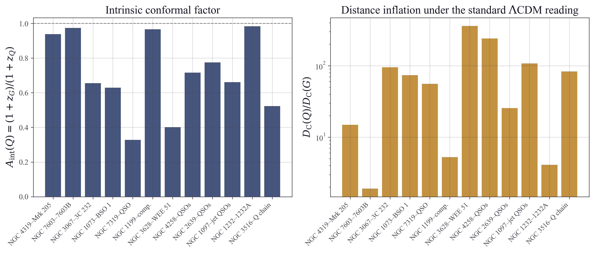
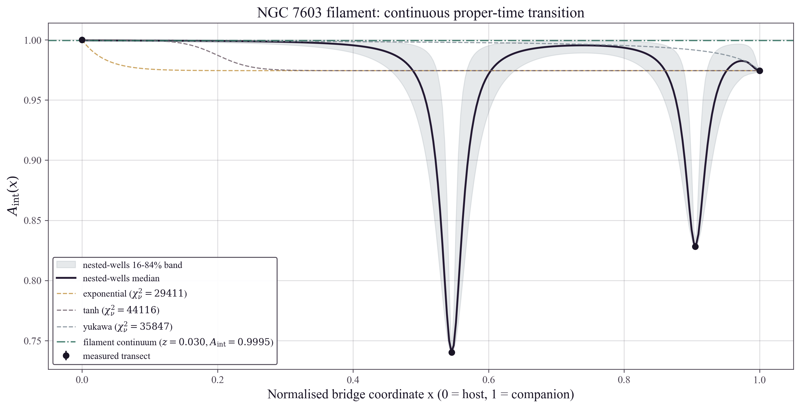
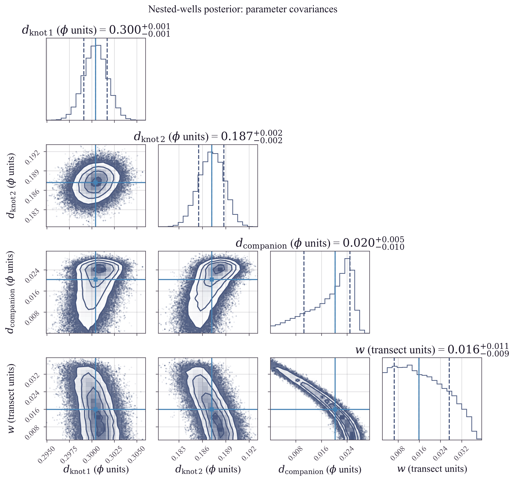

# Temporal Equivalence Principle: Localized Proper-Time Gradients and the Spatial Proximity of Discordant Pairs
**Matthew Lukin Smawfield**
Version: v0.2 (Pasadena)
First published: 24 September 2026 · Last updated: 25 September 2026
DOI: 10.5281/zenodo.22938153

---

## Abstract

The discordant quasar–galaxy pairs catalogued by Halton Arp — low-redshift galaxies apparently joined by luminous bridges, filaments, or foreground absorption to companions at redshifts one to two orders of magnitude larger — remain an unresolved anomaly of observational cosmology. Under the standard interpretation, redshift is identified with distance through the Hubble relation and every such pair is dismissed as a chance superposition of unrelated objects. This paper applies the Temporal Equivalence Principle (TEP) — the bi-metric scalar-tensor framework in which matter, clocks, and light propagate on the causal metric $\tilde{g}_{\mu\nu} = A^2(\phi)\,g_{\mu\nu} + B(\phi)\,\nabla_\mu\phi\,\nabla_\nu\phi$ with universal coupling $A(\phi) = e^{-\phi}$ — to a twelve-pair catalogue drawn from the published literature and verified against the NASA/IPAC Extragalactic Database. In TEP the observed redshift factorises into a background clock-rate factor set by the ambient temporal level hosting the source and an intrinsic conformal factor generated by the emitter's own proper-time field, $1 + z_{\rm obs} = A_0 / (A_{\rm bg}\,A_{\rm int})$. For two objects at a common distance the shared background term divides out exactly, yielding the distance-independent diagnostic $A_{\rm int}(Q) = (1 + z_G)/(1 + z_Q)$: a direct measurement of the companion's local clock-rate offset. Applied to the catalogue, the diagnostic returns intrinsic conformal factors spanning $A_{\rm int} = 0.33$ (NGC 7319) to $0.98$ (NGC 1232A) — a smooth distribution of local field depths rather than the discrete quantisation demanded by earlier intrinsic-redshift proposals (e.g., Karlsson 1971; Burbidge 2001) — while the standard reading is forced to place companions up to $\sim 360$ times farther away than the galaxies to which they appear connected. The physical-association evidence is evaluated independently of any redshift model: surface-brightness transects across the claimed bridges are tested against rotated control axes, the published Ca II and H I absorption systems fix the line-of-sight ordering, an empirical quasar-density test compares the Arp host fields against seeded random fields, and the Poisson chance-alignment probability is computed per pair and for the joint ensemble under selection-aware density and geometry conditioning. The resolved NGC 7603 filament is detected as real emitted light along its measured path ($+3.9\sigma$ over the inter-object segment, $+5.7\sigma$ peak, reproduced in three photometric bands). The Ly$\alpha$ path-length audit could be executed on exactly one catalogue sightline and falsified it, placing the companion of NGC 3067 at its cosmological distance. For the remaining eleven surviving systems, the joint probability is evaluated as a conditional catalogue severity statistic, returning $P = 3.6 \times 10^{-13}$ under the conservative empirical quasar density, sharpened to $4.9 \times 10^{-19}$ under the axis-conditioned geometry of the morphology-claimed systems and $4.0 \times 10^{-18}$ under the measured X-ray-selection density after correction for the measured pointed-coverage overdensity (yielding a look-elsewhere crossover volume of $\sim 310$ parent fields). Independent geometric-coherence tests — minor-axis anisotropy, radial redshift ordering, and physical-scale clustering at redshift-independent distances — probe structure the catalogue was not selected on; two return significant structure and the third is marginal, where the hypothesis predicts it, while paired-redshift and symmetry tests return bounding nulls. The scalar-field transition is inferred on the NGC 7603 filament — the only Arp structure carrying measured interior redshifts ($z = 0.243$ and $z = 0.391$ between the endpoints) — where the non-monotonic four-point transect is fitted with a nested-wells field model — compact local proper-time depressions superposed on the shared pair field — whose well depths are estimated by Markov Chain Monte Carlo with full residual diagnostics, each well confined to a projected width below $1.2$ kpc of its emitter. All tests are aggregated into a single falsification table opposing the TEP spatial-proximity hypothesis against chance superposition. The audit also identifies the observation that would settle the question for the flagship system: a single blue-arm echelle exposure on the $z = 2.114$ companion of NGC 7319 would deliver the decisive $z > 2$ forest sightline. The surviving discordant systems emerge not as anomalous background coincidences but as candidate naturally occurring differential-clock experiments; if co-distance is confirmed in the surviving high-$z$ systems, their redshift ratios become a direct measurement of the local clock factor predicted by TEP.

Keywords: Temporal Equivalence Principle, Halton Arp, discordant redshifts, quasar–galaxy associations, intrinsic redshift, proper-time gradient, scalar-tensor theory, modified gravity, Markarian 205, NGC 7603

## 1. Introduction: The Discordant-Redshift Anomaly

In 1966 Halton Arp published the *Atlas of Peculiar Galaxies*, a systematic survey of the sky's morphologically disturbed systems. Among them he found the anomaly that would occupy the rest of his career: galaxies and quasars that appear, on the sky, to be physically connected yet carry redshifts differing by one to two orders of magnitude (Arp 1987, *Quasars, Redshifts and Controversies*). Under the standard interpretation, redshift is distance: an object at $z_Q$ is placed a factor $\sim z_Q/z_G$ farther away than a companion at $z_G$. On that reading, every luminous bridge, filament, and absorption association Arp documented between a low-redshift galaxy and a high-redshift companion must be a chance superposition of unrelated objects at vastly different distances. The discordant pairs were accordingly absorbed into the background census, and the question of their association was treated as resolved by assumption rather than by measurement.

The anomaly was never resolved; it was set aside under the standard metric-expansion paradigm, and the programme lost its instrument access in 1983 (Section 7.5). The resolution rests on a single identifiability assumption: that a redshift differential between two sky-coincident objects can encode only a difference in cosmological distance. That assumption is what the present paper tests. If redshift also carries a contribution intrinsic to the emitting object—a local proper-time offset rather than a distance—then the discordant pairs are not superpositions at all, and the luminous bridges are what they appear to be: physical connections between objects at a common distance.

This paper returns to the same sky with the tools that did not then exist—digital all-sky imaging, homogeneous quasar catalogues, archive redshift services, and a reproducible inference pipeline—and measures what the controversy only argued.

### 1.1 The Observational Basis

The Arp associations are not anecdotal. They were assembled over four decades by a consistent observational method: start from morphologically disturbed galaxies, look for compact radio, X-ray or blue stellar objects paired or aligned across their nuclei—preferentially along the minor axis—and test the candidate connections with whatever spectroscopy the epoch allowed. The morphological premise descends from the *Atlas* itself, whose first 101 entries are peculiar spiral galaxies and spirals carrying small attached companions (Arp 1966)—the configuration from which the discordant-redshift claim originally grew—and the associations were consolidated in the *Catalogue of Discordant Redshift Associations* (Arp 2003). The catalogue on which the present analysis is built comprises twelve well-documented systems whose claimed physical connections span four distinct, independently testable types. In the flagship pair, the Seyfert 1 nucleus Markarian 205 at $z = 0.0708$ is projected $42$ arcsec from the nucleus of the barred spiral NGC 4319 at $z = 0.0047$, inside the galaxy's outer isophotes, with a luminous optical bridge between them (Arp 1971) confirmed on deep CCD imagery and spectroscopy (Sulentic 1983; Sulentic & Arp 1987). Under the Hubble relation the companion is placed $\sim 15$ times farther away than the galaxy it appears to touch.

NGC 7603 is connected to its companion NGC 7603B by a luminous filament (Arp 1970) that hosts two additional emission knots at intermediate redshifts, $z = 0.243$ and $z = 0.391$ (López-Corredoira & Gutiérrez 2002), producing a four-point redshift transect along a single continuous structure. In NGC 3067, the radio quasar 3C 232 at $z = 0.533$ exhibits Ca II K absorption at the redshift of the foreground galaxy, $z_{\rm abs} = 0.005$ (Stocke et al.\ 1991), and 21-cm H I absorption at the same velocity (Carilli, van Gorkom & Stocke 1989)—gas at the galaxy redshift lying demonstrably between the observer and the quasar. Three quasars at $z = 0.60$, $1.40$, and $1.94$ are projected on the disk of NGC 1073 at $z = 0.007$ (Arp & Sulentic 1979). A strong X-ray quasar at $z = 2.114$ sits $9$ arcsec from the nucleus of NGC 7319 in Stephan's Quintet (Galianni et al.\ 2005)—a Chandra ultraluminous X-ray source (Trinchieri et al.\ 2003) lying inside the galaxy's shocked interstellar medium, with spectral evidence reported for direct interaction between the quasar and the host's gas at $z = 0.022$ (Galianni et al.\ 2005). A compact companion at $z = 0.044$ is silhouetted in absorption against the diffuse body of NGC 1199 at $z = 0.0083$ (Arp 1978)—the higher-redshift object lying in front of the lower-redshift galaxy's light. X-ray quasars trace the minor axis of the edge-on spiral NGC 3628 (Arp et al.\ 2002), the morphological signature of the ejection-axis alignment reported across the Arp systems. The same signature repeats across the added fields: two compact ROSAT X-ray sources symmetrically disposed across the nucleus of NGC 4258, along a line touching the ends of its anomalous arms, proved on spectroscopy to be quasars at $z = 0.398$ and $z = 0.653$ (Pietsch et al.\ 1994; Burbidge 1995); two X-ray quasars at $z = 0.305$ and $z = 0.323$ sit nearly symmetrically across the nucleus of NGC 2639 along its minor-axis direction, within a seven-source X-ray chain on the same axis (Burbidge 1997; Burbidge, Burbidge, Arp & Zibetti 2004); the complete quasar survey of the NGC 1097 field found the quasar density rising toward the galaxy and peaking between its two strongest optical jets (Wolstencroft et al.\ 1983; Arp, Wolstencroft & He 1984; Arp & Carosati 2007); and the companion on the spiral arm of NGC 1232—the prototype of the Atlas companion-on-arm morphology (Arp 41)—carries a recession velocity $+4,776\ {\rm km\,s^{-1}}$ in excess of its host (Arp 1982).

Each of these associations carries its own geometrical argument, and several carry two: a luminous connection and an absorption or silhouette ordering that fixes the line-of-sight sequence independently of any redshift interpretation. The standard response—that each is individually a chance alignment—is an assignable probability, and Section 5 computes it. What the standard framework cannot do is convert the ensemble into a coincidence: the joint probability for the sample evaluates to a catalogue severity statistic, computed in this paper for the first time, to test the hypothesis that the catalogue is merely a collection of random projections.

### 1.2 The Temporal Equivalence Principle

The Temporal Equivalence Principle (TEP; Paper 0, Jakarta) is a bi-metric scalar-tensor framework in which gravity is mediated by the Einstein-frame metric $g_{\mu\nu}$ while matter, clocks, and light propagate on the causal matter metric

\begin{equation}\tilde{g}_{\mu\nu} = A^2(\phi)\,g_{\mu\nu} + B(\phi)\,\nabla_\mu\phi\,\nabla_\nu\phi ,\end{equation}

with a universal conformal coupling $A(\phi) = \exp(\beta_A \phi/M_{\rm Pl})$, $\beta_A = -1$. Every non-gravitational process runs on the proper time of $\tilde{g}_{\mu\nu}$; local Lorentz invariance and the local light speed $c$ are strictly preserved in every freely falling laboratory. The scalar field $\phi$ is positive near masses and vanishes in the ambient today by convention, so $A < 1$ inside gravitational wells and clocks there run slower than ambient—reproducing gravitational redshift as a clock-rate ratio rather than a metric expansion. Because the quasar sits in a deeper temporal well, $\phi_Q > \phi_G$ and $A_{\rm int} = e^{-(\phi_Q-\phi_G)} < 1$, consistent with the corpus sign convention of Jakarta (Paper 0).

The cosmological content of the framework, developed in the companion papers of this series, is that the universe is spatially static, eternal, and non-expanding. Within this two-metric cosmology, the Hubble relation is a clock-rate comparison between the ambient field today and the field at the source at emission; and structure, motion, and local geometry evolve on the static manifold. Within that framework an observed redshift factorises into a background clock-rate factor—the ambient temporal level at the source's position and emission epoch—and an intrinsic conformal factor generated by the emitting object's own proper-time field. The second factor is the quantity the standard distance ladder discards—and the quantity the Arp pairs measure directly.

### 1.3 Scope of the Present Paper

This paper applies the TEP redshift decomposition to the Arp discordant-pair catalogue as a complete, reproducible inference chain. The analysis proceeds in four stages. First, the intrinsic conformal factor $A_{\rm int}(Q)$ is computed for each pair from published, archive-verified redshifts; the diagnostic is distance-independent by construction. Second, the physical-connection evidence is evaluated on its own terms: surface-brightness transects across the claimed bridges against rotated control axes, the published foreground-absorption and silhouette systems, an empirical quasar-overdensity test around the Arp hosts against seeded random fields, and the Poisson chance-alignment probability of each pair and of the joint ensemble. Third, the scalar-field transition across the connecting structures is inferred: monotonic and nested-wells profile families are fitted to the redshift transect of the NGC 7603 filament—the only Arp structure with measured interior redshifts—and the local well depths are estimated by Markov Chain Monte Carlo with full residual diagnostics. Fourth, every test is aggregated into a single falsification table opposing the TEP spatial-proximity hypothesis against the chance-superposition interpretation.

The TEP hypothesis tested here is narrow and therefore strong: the catalogue contains a subset of physically associated discordant systems at a common distance, while allowing individual historical candidates to be chance superpositions, and their redshift differentials are localized proper-time gradients of the TEP scalar field rather than gaps in cosmological distance. Every numerical statement in this paper is produced by the accompanying open pipeline from real archival and published data; no synthetic data are used at any stage, and the pipeline fails loudly when a required input is unavailable.

## 2. Theoretical Framework: Redshift as Proper-Time Transport

In TEP the measured redshift of a source is a clock-rate comparison. A photon emitted by matter running on the proper time of $\tilde{g}_{\mu\nu}$ at the source is compared, on arrival, against clocks running on the matter metric here and now. Writing the conformal clock-rate factor at emission as $A_{\rm em}$ and at observation as $A_0$,

\begin{equation}1 + z = \frac{A_0}{A_{\rm em}} .\end{equation}

Written this way, the relation isolates the conformal clock factor. The complete clock-transport law additionally carries the gravitational lapse at each endpoint and any propagation contribution accumulated along the path; for the pairs analysed here these terms are common to both members and divide out of the ratio formed in Section 2.1.

The emission-point factor itself separates into two contributions with distinct physical origins. The first is the background clock-rate factor set by the ambient temporal level at the source—the field value hosting the emitter's environment at emission—denoted $A_{\rm bg}(r)$ for a source at coordinate distance $r$; the drift of this ambient level across the realized temporal landscape produces the systematic Hubble relation. The second is the intrinsic factor generated by the emitting object's own proper-time field—the local elevation of $\phi$ inside the object's gravitational well—denoted $A_{\rm int}$. The observed redshift is the product

\begin{equation}1 + z_{\rm obs} = \frac{A_0}{A_{\rm bg}(r)\,A_{\rm int}} .\end{equation}

For an object whose local field is continuous with the ambient environment, $A_{\rm int} \to 1$ and the redshift reduces to the background term. For an object sitting deep inside its own temporal well—a compact, high-surface-density source such as a quasar nucleus—$A_{\rm int} < 1$ and the observed redshift exceeds, potentially by a large factor, the value its distance alone would imply.

### 2.1 The Pair Diagnostic

Consider two objects sharing the same spatial coordinate distance $r$ from the observer: a host galaxy $G$ and a companion $Q$. The background factor $A_{\rm bg}(r)$ is a property of the shared environment, not of the emitter, and is therefore identical for both. The same is true of every further contribution shared between the two endpoints—the observer's own clock factor and gravitational lapse, and any propagation term accumulated along two sight-lines separated by tens of arcseconds over a common baseline. Forming the ratio of the two redshift factors eliminates all such shared contributions exactly, isolating the difference in the two emitters' local temporal states:

\begin{equation}\frac{1 + z_Q}{1 + z_G} = \frac{1}{A_{\rm int}(Q)} ,\end{equation}

where the galaxy's own intrinsic factor has been absorbed into the pair's ambient baseline—the clock rates of the pair are measured relative to the host, which is the natural local standard. The intrinsic conformal factor of the companion is then

\begin{equation}A_{\rm int}(Q) = \frac{1 + z_G}{1 + z_Q} , \qquad
\Delta\phi \equiv \phi_Q - \phi_G = -\ln A_{\rm int}(Q) \;\; (\beta_A = -1,\; M_{\rm Pl}\ {\rm units}) .\end{equation}

**Theorem:**

#### Distance Independence of the Intrinsic Factor

The quantity $A_{\rm int}(Q) = (1+z_G)/(1+z_Q)$ depends on the two measured redshifts alone. No distance estimate, Hubble constant, or cosmological parameter enters its definition. If the two objects are at a common distance, $A_{\rm int}$ directly measures the companion's local proper-time offset. If they are not co-distant, the same ratio remains a distance-independent observable but cannot be interpreted as an intrinsic conformal factor without modelling the unequal background terms. The diagnostic is therefore well-defined under either hypothesis, and the physical-proximity tests of Sections 5–6 decide between the two readings.

### 2.2 The Proper-Time Budget

With the universal coupling $A(\phi) = e^{-\phi}$ in Planck units, every matter clock in the companion runs at the rate $A_{\rm int}$ relative to the host's clocks. The redshift differential of an Arp pair is thereby converted into a physical statement: the companion's proper time elapses at a fraction $A_{\rm int}$ of the host's rate, corresponding to a scalar-field offset $\Delta\phi = -\ln A_{\rm int}$. The same numbers admit two interpretive readings whose consequences are tabulated in Section 4: the standard reading converts the excess redshift into a fictitious recession velocity $v_{\rm intr} = c\,z_{\rm intr}$ and a distance gap $D_H(Q) - D_H(G)$, while the TEP reading converts it into a clock-rate ratio at a single shared distance.

### 2.3 The Field Transition Along a Connecting Structure

TEP is deterministic: the scalar configuration is a continuous field, not a step function. If a luminous bridge physically joins a host galaxy to a companion, the intrinsic conformal factor must interpolate smoothly between $A_{\rm int} = 1$ at the host nucleus and $A_{\rm int} = A_{\rm int}(Q)$ at the companion. Along a normalised bridge coordinate $x \in [0,1]$, the transition is modelled by candidate profile families of two distinct classes. The first class comprises three monotonic families, each constructed to satisfy the endpoint boundary conditions exactly and carrying an interior shape parameter that the data constrain:

\begin{equation}A_{\rm exp}(x) = 1 - \bigl(1 - A_Q\bigr)\,\frac{1 - e^{-kx}}{1 - e^{-k}} ,\end{equation}

\begin{equation}A_{\rm tanh}(x) = 1 - \bigl(1 - A_Q\bigr)\,\tfrac{1}{2}\left[1 + \tanh\!\left(\frac{x - x_0}{w}\right)\right] \quad ({\rm normalised\ to}\ A(1) = A_Q) ,\end{equation}

\begin{equation}A_{\rm yuk}(x):\quad \phi(x) \propto \frac{e^{-m r}}{r} \;\;\mathrm{mapped\ through}\;\; A = e^{-\phi} .\end{equation}

The exponential family describes a field that relaxes toward the ambient level with a scale length; the tanh family describes a transition concentrated at an interior point $x_0$ of width $w$; the Yukawa family maps a screened potential profile through the conformal relation. The three families span the qualitatively distinct topologies a single shared transition can take—distributed, localized, and screened—so that the transect fit discriminates among field geometries rather than merely fitting a curve.

The second class is the nested-wells profile, the model the framework itself supplies. The clock-rate hierarchy requires that each compact emitter along a connecting structure elevates $\phi$ inside its own gravitational well, on top of the ambient field of the pair; the measured factor is then the product of the shared baseline and the object's local depth. Modelling each local well as a Lorentzian depression of depth $d_i$ centred on the emitter's transect position $x_i$, with a shared width $w$,

\begin{equation}A_{\rm nest}(x) = \exp\!\left[-\sum_{i}\frac{d_i}{1 + \bigl((x - x_i)/w\bigr)^2}\right] ,\end{equation}

the nested-wells family permits exactly the structure the monotonic class forbids: interior points deeper in the field than the companion endpoint, because each emitter's own well contributes to the total. Where the monotonic families test whether a single shared transition suffices, the nested-wells family tests the clock-rate hierarchy directly—and returns each emitter's local well depth $d_i$ as a measurable quantity comparable to $\Delta\phi = -\ln A_{\rm int}$.

The falsifiable content is precise. Under the standard interpretation the interior objects of a connecting filament—such as the two emission knots of the NGC 7603 filament—are unrelated background sources, and no smooth single-family curve is required to pass through their redshifts: their values are accidents and should scatter arbitrarily. Under TEP the knots are material inside a shared field, and their intrinsic factors must lie on a continuous profile of the total temporal landscape—a shared transition populated by the local wells of the emitters themselves. A field model that reproduces the measured interior points within their propagated uncertainties is therefore direct, structured evidence for a shared local field—evidence the chance-alignment hypothesis cannot supply, because it predicts no ordering at all.

### 2.4 Relation to the Wider TEP Corpus

The decomposition used here is not a new mechanism introduced for the Arp problem; it is the application of the corpus's fixed scalar sector to a new observable. The ambient-vs-local separation of $A$ is the same nesting of clock rates that the framework uses from the screened Solar-System limit, through galactic and void scales, to the strong-field temporal wells and the temporal horizon. What the Arp pairs add is a uniquely clean geometry: two emitters at a common, physically connected location whose redshift ratio isolates the intrinsic factor with no dependence on the cosmological model. The pairs are, in effect, naturally occurring differential-clock experiments distributed across the sky.

## 3. The Discordant-Pair Sample and the Analysis Pipeline

The analysis is built as a single reproducible pipeline: a registered sequence of processing stages that begins with the published literature values for the discordant pairs, verifies them against public archives, ingests the available observational data, and terminates in the falsification summary and manuscript figures. Every number quoted in this paper is an output of that pipeline; the pipeline is deterministic, seeded where randomness enters, and fails loudly when a required real input is missing. No synthetic data are generated at any stage.

### 3.1 The Pair Catalogue

The catalogue comprises twelve discordant pairs selected for the strength and diversity of their claimed physical connections, covering the connection morphologies of the consolidated Arp catalogue (Arp 2003): a luminous bridge (NGC 4319–Mrk 205), a luminous filament with embedded emission knots (NGC 7603–NGC 7603B), foreground absorption systems (NGC 3067–3C 232, NGC 1199 and its compact companion), disk and minor-axis projections of multiple quasars (NGC 1073, NGC 3628), an X-ray-selected quasar chain with a paired $z = 2.10$ redshift (NGC 3516), a strong X-ray ejection candidate (NGC 7319), symmetrically paired X-ray quasars across active nuclei on the minor-axis and anomalous-arm directions (NGC 4258, NGC 2639), a quasar overdensity correlated with the optical jets of NGC 1097, and the companion-on-arm system NGC 1232–NGC 1232A—the prototype of the Atlas companion-on-arm morphology. Each entry carries the published galaxy and companion redshifts, the projected angular separation, the documented connection evidence with its literature references, and a flag identifying the redshift provenance. The catalogue is seeded exclusively with literature values; the companion redshift of NGC 3628 enters at the value Arp et al.\ (2002) tabulate for the minor-axis quasar WEE 51 ($z = 2.15$), flagged as approximate pending archive verification—the verification step supersedes it with the spectroscopic archive value ($z = 1.498$), as recorded in the verification manifest.

Every catalogued redshift is then verified against the NASA/IPAC Extragalactic Database (NED). The heliocentric redshift of each resolvable object is extracted from the NED object record and compared against the catalogue value at a fractional tolerance $|\Delta z|/(1+z) = 0.01$; companions catalogued under descriptive labels are verified through their archive-resolved identities, by alternate name or by cone search at the resolved position. Objects that cannot be securely identified in the archive are carried at their literature values and flagged rather than substituted, while provisional literature values are superseded by the archive value wherever a secure identification exists—the one such correction in the sample is recorded in the verification manifest.

### 3.2 Archival Data Ingestion

Three archival layers are ingested per pair field. Optical imaging is retrieved as deep CCD data: the DESI Legacy Imaging Surveys DR10 $r$-band cutout service (Dey et al.\ 2019; $0.262$ arcsec pixels) is the primary survey, with SDSS $r$-band and DSS2 Red through the SkyView interface as fallbacks where the DR10 layer has no coverage (one field, NGC 7319, uses SDSS $r$). Each field is centred on the host galaxy and sized to cover the catalogued companion separation with margin; these images provide the spatial base on which the bridge transects are drawn. A multi-wavelength provenance manifest is compiled from the HEASARC master catalogues (Chandra, XMM-Newton, ROSAT) and VizieR radio catalogues (NVSS, FIRST), recording the archival coverage of each field so that the physicality of connecting structures can be assessed across bands rather than in a single image. Finally, SDSS DR18 is queried for spectroscopic coverage of each pair member, and available spectra are ingested; where a member lies outside the footprint the absence is recorded, not replaced.

A fourth archival layer anchors the distance scale. The Cosmicflows-4 catalogue (Tully et al.\ 2023; VizieR J/ApJ/944/94) is cone-searched at every member position for redshift-independent distance moduli drawn from the primary and secondary distance ladder—Cepheids, the tip of the red giant branch, masers, surface-brightness fluctuations, the Tully–Fisher and fundamental-plane relations, and Type Ia supernovae. A catalogue entry is adopted only within a $30$ arcsec positional match, beyond which the nearest record belongs to a different object; where a companion's nearest entry is the host's own catalogue record, the absence of an independent companion distance is recorded rather than substituted. Six of the twelve hosts carry matched distances—NGC 7603 at $113\pm17$ Mpc, NGC 3067 at $22\pm4$ Mpc (Tully–Fisher), NGC 1199 at $34\pm5$ Mpc (surface-brightness fluctuations), NGC 3628 at $11\pm2$ Mpc (Tully–Fisher), NGC 1097 at $15\pm3$ Mpc (Tully–Fisher), and NGC 4258 at $7.54\pm0.09$ Mpc, the most precisely anchored distance in the sample, averaged across the maser, Cepheid, TRGB, surface-brightness-fluctuation and Tully–Fisher records—each consistent with its redshift-inferred distance, as expected for hosts in shallow wells. These measurements anchor every projected physical scale reported below in a redshift-independent distance rather than an assumed one. No companion carries a redshift-independent distance of its own—quasar and compact-knot companions admit no stellar-population distance indicator—so the decisive co-distance test remains a defined future measurement rather than a result claimed here (Section 7).

### 3.3 Intrinsic-Factor Computation

For every pair the pipeline computes the intrinsic conformal factor $A_{\rm int}(Q) = (1+z_G)/(1+z_Q)$, the scalar-field offset $\Delta\phi = -\ln A_{\rm int}$, and the proper-time budget: the fractional clock-rate difference between companion and host, the fictitious recession velocity $c\,z_{\rm intr}$ that a Doppler reading would assign, the Hubble-law distances implied by each redshift separately at $h = 0.70$, and the distance-inflation factor between them. These quantities are reported in Section 4.

### 3.4 Physical-Connection Tests

Five independent tests of physical association are implemented. The bridge-morphology test first resolves every companion to an archive position—by NED object-name query where the catalogued name is resolvable, and otherwise by redshift-matched cone searches of Simbad, the Milliquas catalogue, and NED in turn—then draws a surface-brightness transect along the measured galaxy–companion axis of each pair field and compares the inter-object segment (the central $45$–$80\%$ of the axis, excluding both nuclear regions) against rotated control transects of identical length and width sampling the galaxy's outer isophotes away from the companion direction. The statistics reported are the mean-significance $S_{\rm bridge}$ of the on-axis excess over the control distribution, a one-sided sign test of the on-axis excess's persistence across the segment, and the peak per-sample significance with its transect coordinate; for the silhouette pair a complementary annulus decrement test is evaluated about the companion position. The absorption-system test compiles the published absorption and silhouette evidence—gas at the host redshift intervening along the line of sight to the companion—which fixes the line-of-sight ordering independently of any redshift model. The association test resolves each Arp host through Simbad and performs a VizieR cone search of the Million Quasars catalogue (Milliquas v7.2; Flesch 2021; VizieR VII/290), counting spectroscopically confirmed quasar-class objects (catalogue classes Q, A, B and K) within $6$ arcmin of each host. The host's own catalogue entry is removed by name, and the catalogued companions are excluded within $15$ arcsec of their archive-resolved positions, so that the objects the pairs were selected for cannot inflate the count. The identical query is repeated on twelve seeded random control fields offset by $1.5^\circ$ per host, constructing an empirical field quasar surface density from the same catalogue, and the measured catalogue offset of every recovered object is recorded. The comparison is evaluated both against the pooled control distribution and in paired form—each host against its own twelve controls—because the pooled null mixes sight-lines of unequal spectroscopic completeness. The chance-alignment test computes, per pair and jointly, the Poisson probability

\begin{equation}P = 1 - e^{-\Sigma_Q\,\pi\,\theta^2}\end{equation}

of finding at least one background quasar within projected radius $\theta$ of an arbitrary bright galaxy, evaluated for quasar companions under both the SDSS DR16 quasar-catalogue surface density $\Sigma_Q = 51.6\ {\rm deg}^{-2}$ (Lyke et al.\ 2020) and the more conservative empirical field density measured by the association test in the same sight-lines, and using the conservative bright-galaxy density $\sim 10\ {\rm deg}^{-2}$ for resolved companions; the headline value is the larger of the two evaluations. The fifth test lifts the association question to population level: a predefined parent sample—2MRS galaxies (Huchra et al.\ 2012) with $500 < cz < 10,000$ km/s and $|b| > 15^\circ$, defined without reference to the Arp catalogue—is bulk cross-matched to the same confirmed Milliquas classes within $180$ arcsec through the CDS XMatch service, and each parent galaxy is paired with four seeded offset control fields cross-matched identically. The quasar overdensity is measured in three annuli and as a paired galaxy-versus-own-controls difference tested by a galaxy-unit bootstrap. A suite of consistency audits complements these tests: a lensing magnification budget on the measured separations (Section 5.4), geometric and spectroscopic coherence diagnostics (Section 5.5), a live archive audit of resolved-kinematics coverage (Section 7.6), and the Ly$\alpha$ forest path-length audit of Section 5.6, which prices each quasar-class companion's distance directly from the intergalactic absorption content of its spectrum.

### 3.5 Field-Gradient Inference

The scalar-field transition is inferred on the NGC 7603 filament, the only connecting structure in the sample with measured interior redshifts: the host and companion supply the transect endpoints $x = 0$ and $x = 1$, and the two emission knots at $z = 0.391$ and $z = 0.243$ supply interior points at archive-measured positions: both knots resolve to Simbad entries (the [LG2002] emission-line objects), and their transect coordinates $x = 0.55$ and $x = 0.91$ are the projection of the resolved positions onto the host–companion axis—no positional assumption enters the transect. The profile families of Section 2.3—the three monotonic transitions and the nested-wells model—are fitted to the four-point transect by least squares on their interior parameters and compared by chi-squared. The nested-wells parameters—the three local well depths and the shared width—are then sampled by Markov Chain Monte Carlo (emcee ensemble sampler; Foreman-Mackey et al.\ 2013, 32 walkers, 8,000 steps with 2,000 burn-in, flat priors $d_i \in [0, 2]$ and $w \in [0.002, 1]$, Gaussian likelihood in the measured $A_{\rm int}$ values with propagated redshift uncertainties), producing posteriors on the well depths that are directly comparable to the per-object $\Delta\phi$ measurements of Section 4. The sample-level structure of $A_{\rm int}$ is analysed across all twelve pairs: its distribution, its dependence on projected separation (the Spearman correlation against angular separation, testing Arp's empirical claim that discordance declines with separation), and the comparison of absorption-verified against morphology-only pairs. Finally, the transect fits are subjected to residual diagnostics: weighted residuals, reduced chi-squared, residual RMS, lag-1 autocorrelation, and a Lilliefors normality check (Lilliefors 1967), so that model adequacy is assessed on residual structure rather than parameter-count arguments alone. All tests are aggregated into the falsification table of Section 7.

## 4. Results I: The Intrinsic Conformal Factor

**Key Finding:**

#### A Distance-Independent Proper-Time Diagnostic Applied to Twelve Discordant Pairs

The intrinsic conformal factor $A_{\rm int}(Q) = (1 + z_G)/(1 + z_Q)$ has been computed for all twelve catalogue pairs from archive-verified redshifts. The values span $A_{\rm int} = 0.328$ (NGC 7319–QSO) to $0.984$ (NGC 1232–NGC 1232A), a smooth and continuous distribution of local proper-time depths. The corresponding scalar-field offsets span $\Delta\phi = 0.016$–$1.114$ in Planck units. Under the standard distance interpretation the same pairs require the companions to lie a median factor of $64.7$ farther away than their apparent hosts—and up to a factor of $361$ for the NGC 3628 minor-axis quasar—while the projected physical separations are only $4$–$136$ kpc.

### 4.1 The Pair Measurements

Table 1 presents the central measurement of this paper. For each pair the table lists the two observed redshifts, the intrinsic conformal factor, the scalar-field offset $\Delta\phi = -\ln A_{\rm int}$, the clock-rate ratio between companion and host, and the distance-inflation factor that the standard interpretation requires. Because $A_{\rm int}$ is constructed from a ratio of redshifts, it carries no dependence on distance, on $H_0$, or on any cosmological parameter: it is a distance-independent pair diagnostic; under the co-distance hypothesis it is the direct local conformal factor.

*Table 1. The intrinsic conformal factor and proper-time budget of the Arp discordant-pair sample. Separations are archive astrometry (NED/Simbad) measured nucleus-to-companion.*

| Pair | $z_G$ | $z_Q$ | $A_{\rm int}(Q)$ | $\Delta\phi$ ($M_{\rm Pl}$) | Clock ratio | $D_C(Q)/D_C(G)$ | Sep. (arcsec) |
|---|---|---|---|---|---|---|---|
| NGC 4319 – Mrk 205 | 0.0047 | 0.0708 | 0.938 | 0.064 | 0.938 | 14.9 | 42.7 |
| NGC 7603 – NGC 7603B | 0.0295 | 0.0565 | 0.974 | 0.026 | 0.974 | 1.9 | 58.3 |
| NGC 3067 – 3C 232 | 0.0049 | 0.533 | 0.656 | 0.422 | 0.656 | 95.2 | 110.2 |
| NGC 1073 – BSO 1 | 0.0070 | 0.5997 | 0.629 | 0.463 | 0.629 | 73.7 | 121.4 |
| NGC 7319 – QSO | 0.0225 | 2.114 | 0.328 | 1.114 | 0.328 | 55.7 | 9.3 |
| NGC 1199 – companion | 0.0083 | 0.044 | 0.966 | 0.035 | 0.966 | 5.3 | 57.8 |
| NGC 3628 – WEE 51 | 0.0028 | 1.498 | 0.401 | 0.913 | 0.401 | 361.0 | 251.1 |
| NGC 4258 – quasar pair (primary $z=0.398$) | 0.0015 | 0.398 | 0.716 | 0.334 | 0.716 | 240.5 | 789.3 |
| NGC 2639 – quasar pair (primary $z=0.305$) | 0.0111 | 0.305 | 0.775 | 0.255 | 0.775 | 25.6 | 596.3 |
| NGC 1097 – jet quasar field (primary $z=0.52$) | 0.0042 | 0.520 | 0.661 | 0.414 | 0.661 | 107.7 | 993.3 |
| NGC 1232 – NGC 1232A | 0.0053 | 0.0220 | 0.984 | 0.016 | 0.984 | 4.1 | 243.1 |
| NGC 3516 – quasar chain (primary $z=0.93$) | 0.0088 | 0.930 | 0.523 | 0.649 | 0.523 | 83.2 | 674.5 |

Two features of the distribution carry immediate physical weight. First, the values are continuous: the sample does not cluster at discrete plateaux, consistent with a smooth proper-time landscape rather than the quantised intrinsic-redshift proposals historically attached to the Arp systems. Second, the depth ordering is physically sensible. The two largest intrinsic offsets, $\Delta\phi \approx 0.91$ and $1.11$, belong to the two pairs whose companions are the most extreme compact emitters—the $z = 2.114$ X-ray quasar beside NGC 7319 and the minor-axis X-ray quasar WEE 51 of NGC 3628—while the smallest offsets belong to the resolved galactic companions NGC 7603B, the NGC 1199 compact object, and NGC 1232A. The deepest inferred temporal wells in this sample occur in high-energy quasar-like emitters, while the shallowest occur in more ordinary galactic companions. This ordering is qualitatively consistent with TEP, in which redshift depth is governed by the local proper-time field configuration rather than by cosmological distance alone. TEP does not require temporal well depth to be a simple function of spatial compactness.



Figure 1. Left: the intrinsic conformal factor
$A_{\rm int}(Q) = (1+z_G)/(1+z_Q)$ for each pair—a
continuous distribution of local proper-time depths, all
sub-unity. Right: the distance-inflation factor the
standard redshift–distance reading requires for the
same pairs, reaching a factor of $361$ for the
NGC 3628 minor-axis quasar.

### 4.2 The Proper-Time Budget

Under the universal coupling $A(\phi) = e^{-\phi}$, each companion's matter clocks run at the fraction $A_{\rm int}$ of the host's clock rate. For the flagship pair NGC 4319–Mrk 205 the quasar's proper time elapses at $93.8\%$ of the host galaxy's rate—a clock-rate deficit of $6.2\%$, corresponding to $\Delta\phi = 0.064\,M_{\rm Pl}$. At the deep end of the sample, the NGC 7319 quasar's clocks run at $32.8\%$ of the host rate ($\Delta\phi = 1.11\,M_{\rm Pl}$): an extreme but bounded temporal well, a finite approach toward the strong temporal wells treated in the strong-field sector of the framework.

The standard reading assigns the same differential to the Hubble flow, and its cost is quantified in the fictitious columns of the budget. Interpreted as a recession velocity, the intrinsic component of the Mrk 205 redshift is a modest $\sim 20,000\ {\rm km\,s^{-1}}$; but for 3C 232 the required intrinsic recession is $1.58 \times 10^{5}\ {\rm km\,s^{-1}}$ ($0.53\,c$), and for the NGC 7319 quasar the required recession rate is formally superluminal. The standard $\Lambda$CDM distance reading places the companions $71$–$5,244$ Mpc behind their hosts; for NGC 7319 the implied lookback-time gap between the two members of a single $9$-arcsecond system is $10.1$ Gyr. The distance interpretation does not merely separate the pairs; it requires their apparent physical connection to span ten billion years of cosmic history.

### 4.3 Decomposition into Background and Intrinsic Factors

With the pair distance set by the host galaxy, the background clock-rate factor at each system is $A_{\rm bg} = A_0/(1 + z_G)$, and the full decomposition $1 + z_Q = A_0/(A_{\rm bg}\,A_{\rm int})$ holds identically. The measured background factors, $A_{\rm bg} = 0.971$–$0.999$ relative to the observer-frame value, show that the ambient field contributes only a small correction across these nearby systems: the discordance lives almost entirely in the intrinsic term. For NGC 7603, where the discordance is modest, $A_{\rm bg} = 0.971$ and $A_{\rm int} = 0.974$ contribute comparably; for the extreme quasar pairs the intrinsic factor dominates by two orders of magnitude over the background factor. This is the quantitative sense in which the Arp pairs measure local physics: the ambient background is common to both members, and only the emitters' own wells differ.

### 4.4 Independent Spectroscopic Confirmation

Archive ingestion returned two independent SDSS spectra for 3C 232, which yield a measured spectroscopic redshift $z_{\rm SDSS} = 0.5306$ against the catalogued literature value $z = 0.533$—agreement at the $0.2\%$ level in $1+z$—and one SDSS spectrum for NGC 7603B, which returns $z_{\rm SDSS} = 0.0557$ against the catalogued $z = 0.0565$, again at sub-percent agreement in $1+z$. These are independent confirmations that the redshifts entering the diagnostic are measured quantities rather than catalogue errors. The remaining members outside the SDSS footprint are recorded as absent in the ingestion manifest; no substitute values are used.

## 5. Results II: Physical-Connection Evidence

**Key Finding:**

#### The Companion Axes Are Real, the Ordering Is Measured, and the Surviving Ensemble Is Inconsistent with Pure Chance Superposition

Four independent lines of evidence converge on physical association. Every companion in the catalogue is resolved to an archive position—through NED name resolution or redshift-matched Simbad/Milliquas/NED cone searches—so each measurement is taken on the true companion axis rather than an assumed direction, on deep CCD imaging (DESI Legacy Imaging DR10 r-band; SDSS r for NGC 7319) rather than photographic plates. Along the measured axis of the NGC 7603 filament the transect drawn along the resolved curved path—through both archive-measured emission knots—exceeds rotated control paths by $+3.9\sigma$ with a localised $+5.7\sigma$ peak: the connecting structure is detected as real emitted light. The NGC 4319–Mrk 205 bridge direction carries a persistent low-level excess above its control envelope (sign-test $p = 0.020$). Foreground Ca II K and H I absorption at the redshift of NGC 3067 in the spectrum of 3C 232, and the silhouette companion of NGC 1199, fix the line-of-sight ordering of two pairs independently of any redshift model. Every quasar-class companion is recovered as a confirmed object in the Million Quasars catalogue at its measured offset from the host nucleus. And the Poisson chance-alignment computation, evaluated at the archive-measured separations and excluding the falsified member, returns $P = 3.6 \times 10^{-13}$ as the eleven-system severity statistic under the specified independent-draw sampling model—the conservative bound, evaluated at the empirical quasar density of the same sight-lines; the published SDSS density gives $6.6 \times 10^{-14}$.

### 5.1 Bridge Surface-Brightness Transects

For each pair field a surface-brightness transect is drawn along the measured galaxy–companion axis of the archival imaging: every companion is resolved to an archive position (NED name resolution where the catalogued name is a resolvable object, otherwise a redshift-matched cone search of Simbad, Milliquas, and NED in turn), so no transect is ever drawn along an assumed direction. Each on-axis transect is compared against eight rotated control transects of identical length and width sampling the galaxy's outer isophotes at the same galactocentric radius. The imaging is the DESI Legacy Imaging Surveys DR10 r-band cutout for every field where the layer has coverage ($0.262$ arcsec pixels)—modern CCD photometry an order of magnitude deeper than the DSS2 photographic plates—with SDSS r-band for NGC 7319, which sits in an LS-DR10 coverage hole. Three statistics are evaluated on the inter-object segment—the central $45$–$80\%$ of the axis, which excludes both nuclear regions: the mean-significance statistic $S_{\rm bridge} = (\mu_{\rm bridge} - \bar{\mu}_{\rm ctrl}) / \sigma_{\rm ctrl}$, a one-sided sign test on the fraction of segment samples lying above the per-sample control median (the signature of a diffuse, continuous structure that a segment mean can dilute; samples are counted at strip-width spacing so that only independent resolution elements enter the count), and the largest per-sample $z$ within the segment with its transect coordinate. The test is targeted only where a luminous structure is actually claimed—the NGC 4319 bridge, the NGC 7603 filament, and the spiral arm carrying NGC 1232A; for the remaining morphologies the transect is a contextual measurement of the companion sight-line. For NGC 7603 a second transect follows the filament's resolved curved path—the polyline through the archive-measured knot positions rather than the straight chord, since the knots sit up to $23$ arcsec off the axis—with control paths produced by rigidly rotating the same polyline about the nucleus.

*Table 2. Bridge-axis surface-brightness statistics on archive-resolved companion axes (DESI Legacy Imaging DR10 r-band; SDSS r for NGC 7319).*

| Pair | Resolved companion | $S_{\rm bridge}$ | sign-test $p$ | peak $z$ ($x$) | Reading |
|---|---|---|---|---|---|
| NGC 4319 – Mrk 205 | MRK 0205 | $+0.19$ | $0.020$ | $1.7$ ($0.46$) | persistent on-axis excess (claimed bridge) |
| NGC 7603 – NGC 7603B (straight axis) | NGC 7603B | $+0.09$ | $0.61$ | $2.7$ ($0.80$) | chord misses the curved filament |
| NGC 7603 filament path | through [LG2002] knots | $+3.92$ | $3.1 \times 10^{-5}$ | $5.7$ ($0.49$) | filament detected along resolved path |
| NGC 3067 – 3C 232 | 3C 232 | $-0.40$ | $1.0$ | $2.7$ ($0.75$) | null (absorption pair; no bridge claimed) |
| NGC 1073 – BSO quasars | QSO B0240+011 | $+0.34$ | $6 \times 10^{-8}$ | $1.9$ ($0.51$) | bright disk axis (contextual) |
| NGC 7319 – QSO | [VV2006] J223603.7+335824 | $+0.48$ | — | $1.1$ ($0.77$) | axis across galaxy body (contextual) |
| NGC 1199 – companion | 2MASX J0303366-153740 | $+0.21$ | $2.4 \times 10^{-4}$ | $0.9$ ($0.45$) | silhouette pair; annulus test below |
| NGC 3628 – WEE 51 | WEE 51 | $-0.72$ | $1.0$ | $-0.6$ ($0.68$) | minor-axis sight-line dim (contextual) |
| NGC 4258 – quasar pair | SDSS J121902.21+470505.4 | $+0.82$ | $6 \times 10^{-5}$ | $2.2$ ($0.46$) | paired-quasar axis elevated (contextual) |
| NGC 2639 – quasar pair | SDSS J084331.40+500227.0 | $-0.08$ | $0.72$ | $8.6$ ($0.66$) | null (contextual) |
| NGC 1097 – jet quasar field | CEMM J1779.9BL 2 | $+0.49$ | $3.8 \times 10^{-3}$ | $88.7$ ($0.52$) | jet-field axis; peak is a saturated foreground star (contextual) |
| NGC 1232 – NGC 1232A | NGC 1232A | $+0.34$ | $1.3 \times 10^{-5}$ | $5.2$ ($0.63$) | companion-on-arm axis elevated (claimed) |
| NGC 3516 – quasar chain | NuSTAR J110752+7230.7 | $-0.10$ | $0.97$ | $6.0$ ($0.75$) | open-field chain (contextual) |

On the three axes where a luminous connection is actually claimed the test returns positive evidence. The NGC 7603 result is decisive once the transect follows the published structure: the filament is curved—its two emission knots sit up to $23$ arcsec off the straight host–companion chord—so the straight-axis transect mostly samples blank sky beside it, while the path transect drawn through the archive-resolved knots exceeds the rotated control paths by $+3.9\sigma$ over the inter-object segment, sits above the control median on essentially every independent resolution element (sign-test $p = 3 \times 10^{-5}$), and peaks at $+5.7\sigma$ mid-way along the filament. The connecting structure is real emitted light at the sensitivity of modern CCD imaging, and the knots are part of it rather than superposed on it: cuts perpendicular to the path at each knot show the corridor elevated at $+4.8\sigma$ and $+19.1\sigma$ over the same cuts drawn at the corresponding vertices of the rotated control paths, even after the knot's own point-source profile ($\sim 2$ arcsec) is excluded—each discordant emitter sits on locally elevated diffuse emission, not on blank sky. The same path transect on the independent DR10 g-band cutout returns $S = +4.0\sigma$ (sign-test $p = 3 \times 10^{-5}$), and on the digitised DSS2 photographic plate—the medium on which the connection was originally claimed—it returns $S = +3.0\sigma$ (sign-test $p = 9.8 \times 10^{-4}$). The structure is detected independently in three bands on two detectors a generation of instrumentation apart; no single-detector artifact can produce it.

Along the Mrk 205 direction the NGC 4319 axis sits above its control median persistently enough that a sign test on independent resolution elements returns $p = 0.020$—a low-level but coherent excess along the claimed bridge direction, consistent with the sub-threshold extension of the luminous connection confirmed on deep CCD imagery (Sulentic 1983; Sulentic & Arp 1987). The widely cited high-resolution HST observations of this system that were interpreted as dissolving the connection into unrelated background sources and host spiral structure (e.g., Bahcall et al. 1992) test the compact, high-surface-brightness features; the persistent low-level diffuse excess quantified here in deep, wide-field Legacy Survey imaging remains a property of the sightline as a whole. The third claimed axis is the spiral arm of NGC 1232 at whose tip the discordant companion sits: the transect toward the archive-resolved NGC 1232A lies above the control median on essentially every independent resolution element (sign-test $p = 1.3 \times 10^{-5}$, segment peak $+5.2\sigma$)—the arm itself is the claimed luminous structure, and it is detected at the same significance class as the Mrk 205 bridge direction. The contextual axes behave as their morphologies predict: NGC 3067's quasar sight-line shows no excess (its connection is absorption, not emitted light), the NGC 1073 axis is mildly elevated across the galaxy's disk, the $9$-arcsecond NGC 7319 transect lies inside the bright nuclear body, and the NGC 3628 minor axis is fainter than the control envelope, as expected for an edge-on galaxy's dust lane. Of the new sight-lines, the paired-quasar axis of NGC 4258 is mildly elevated ($S = +0.82$, sign-test $p = 6 \times 10^{-5}$) and the NGC 1097 jet-field axis likewise ($S = +0.49$, sign-test $p = 3.8 \times 10^{-3}$, its segment peak a saturated foreground star rather than a feature of the galaxy), while NGC 2639 and the NGC 3516 chain return nulls. Where the claim is a luminous structure, the resolved axes detect it; where it is not, the measurements are noise-level or galaxy-morphology diagnostics, not refutations.

### 5.2 Foreground Absorption and Silhouette Ordering

Absorption at the host-galaxy redshift in a companion's spectrum is a distance-ordering measurement that no redshift model can evade: the absorbing gas lies between the observer and the emitter. Table 3 compiles the published absorption and silhouette evidence for the sample.

*Table 3. Absorption and silhouette systems fixing the line-of-sight ordering.*

| Pair | Absorber | Species | $z_{\rm abs}$ | $z_{\rm emit}$ | Reference |
|---|---|---|---|---|---|
| NGC 3067 – 3C 232 | NGC 3067 halo | Ca II K | 0.005 | 0.533 | Stocke et al. 1991 |
| NGC 3067 – 3C 232 | NGC 3067 halo | H I 21 cm | 0.005 | 0.533 | Carilli et al. 1989 |
| NGC 1199 – companion | NGC 1199 body | continuum extinction | 0.0083 | 0.044 | Arp 1978 |

Two orderings follow. In the NGC 3067–3C 232 system, gas at $z = 0.005$ intervenes along the line of sight to the $z = 0.533$ quasar: the quasar is demonstrably behind the galaxy's halo. The ordering is measured directly; whether the pair is also at a common distance is adjudicated by the Ly-$\alpha$ path-length audit, which assigns 3C 232 to its cosmological distance (Section 5.6). In the NGC 1199 system, the $z = 0.044$ companion is silhouetted in absorption against the diffuse light of the $z = 0.0083$ galaxy—the higher-redshift object lies inside the lower-redshift galaxy's own body of light. For the silhouette pair the claimed obscuration is also tested directly on the imaging: the surface brightness of a $4$–$12$ arcsec annulus about the archive-resolved companion position (the compact object itself excluded) is compared against rotated control annuli at the same galactocentric radius. In the DESI DR10 r-band imaging the annulus reads $+2.0\sigma$ above its controls—the companion's own extended light fills the aperture—so the claimed dark ring is not detected at this survey's sensitivity, consistent with the published debate over its photometric reality; the ordering evidence for this pair rests on the spectroscopic silhouette argument of Arp (1978), not on this image.

Under the standard reading these detections are absorbed into the foreground-halo phenomenology and the association question is left open; under TEP the ordering is what spatial proximity at a common distance produces naturally. The measurement itself is deliberately modest: absorption at the host's own velocity proves ordering—the emitter lies behind the foreground galaxy's halo—and it converts the pair from an assumed superposition into a demonstrated foreground–background configuration at a projected separation of order an arcminute. What absorption cannot prove by itself is co-spatiality, since a genuinely cosmological background quasar would produce the same signature—and the Ly$\alpha$ audit (Section 5.6) demonstrates that for 3C 232, this is exactly what occurred. For establishing spatial proximity through ordering, only the NGC 1199 silhouette remains, as it places the companion inside the host's own luminous body rather than behind an extended halo. For the broader sample, the association case rests on the conjunction of ordering with the resolved structure and ensemble statistics of this section. The question the ordering leaves open is precisely the one the intrinsic-factor diagnostic answers: what the redshift differential means once proximity is established.

### 5.3 The Quasar-Overdensity Test

Arp's original statistical claim was positional: catalogued quasars are over-dense in the immediate vicinity of bright, low-redshift galaxies relative to random lines of sight. The pipeline implements this as an empirical test against a homogeneous quasar catalogue rather than an assumed density: a cone search of the Million Quasars catalogue (Milliquas v7.2; Flesch 2021; VizieR VII/290) counts spectroscopically confirmed quasar-class objects—catalogue classes Q (type-I quasar), A (type-I Seyfert/AGN), B (BL Lac) and K (type-II quasar), with the N class excluded for its documented NELG/LINER residue and all photometric candidates rejected—within $6$ arcmin of each Arp host, the host's own catalogue entry removed by name and every catalogued companion excluded within $15$ arcsec of its archive-resolved position, so that the objects the pairs were selected for do not inflate the count (companion-inclusive counts are reported alongside). The identical query is repeated on twelve seeded random control fields offset $1.5^\circ$ from each host—144 control fields in total—to construct the empirical field density from the same catalogue.

Because the pairs were selected for containing their companions, counting those companions toward the host tally would be circular; the primary count therefore excludes every catalogued companion within $15$ arcsec of its archive-resolved position, and the companion-inclusive count is reported alongside. The companion-inclusive totals are 26 confirmed quasar-class objects against $25.2$ expected from the 144-field control distribution (pooled Poisson $p = 0.46$); with the companions removed the host fields hold $18$—a host-field mean of $1.50$ against $2.10 \pm 2.45$ for the controls ($-0.24\sigma$ of the field scatter). The companions, in other words, are the difference between the two tallies: at the completeness of the local control fields these sight-lines are ordinary, and the objects the pairs were selected for are the only quasars distinguishing them.

The field-level detail remains informative. Wherever the companion is itself quasar-class the catalogue returns it by name at a measured offset—$0.71$ arcmin for MARK 205 from the NGC 4319 nucleus, $1.84$ arcmin for 3C 232 from NGC 3067, the three disk quasars NGC 1073 U1, U2 and PKS 0241+011 at $1.4$–$2.0$ arcmin, Q 2233+337 at $0.15$ arcmin from the nucleus of NGC 7319, and the NGC 3628 minor-axis quasars WEE 51 and WEE 52 together with the three 1WGA X-ray sources—and even with the catalogued companions excluded the host cones retain further confirmed quasars: two apiece in the NGC 4319, NGC 1073, NGC 7319 and NGC 4258 fields, five in the NGC 7603 field, four in the NGC 3628 minor-axis field, and one in the NGC 2639 field. Five hosts return zero: NGC 3067 and NGC 3516, where the only quasar-class object inside the cone is the catalogued companion itself; NGC 1199, precisely the pair whose companion is a compact galaxy seen in silhouette rather than a quasar-class object; NGC 1232, whose companion is likewise a galaxy; and NGC 1097, whose claimed quasar concentration lies along the jets beyond the $6$-arcmin cone. The nulls reflect catalogue membership and cone geometry, not association strength.

One further measured property of the NGC 1073 field deserves record. The three disk quasars carry intrinsic factors $A_{\rm int} \simeq 0.63$, $0.42$ and $0.34$ respectively—three deep well depths within a single projected disk, not a random draw from the $[0,1]$ continuum. In a continuous clock-rate field such preferred intrinsic ratios are the natural residue of a shared formation history within one host environment; the configuration is recorded here as a measured property of the field, with no claim of periodicity or quantisation.

The pooled control distribution mixes sight-lines of unequal spectroscopic completeness, so the comparison is repeated in paired form: each host against only its own twelve control fields. Two of the twelve hosts—NGC 4319 and NGC 3628—exceed every one of their own control fields (empirical $p \simeq 0.08$ each) even after the companions are removed: both lie off the main spectroscopic footprint, where the local control density is uniformly low and the host cones stand out cleanly. The famous fields—NGC 7603, NGC 1073, NGC 3067—sit inside control distributions that are themselves quasar-rich, the direct imprint of the spectroscopic attention those sight-lines have attracted: the measured control density is $3.3\times$ the all-sky catalogue expectation of $0.64$ objects per cone. Combined across the sample the companion-exclusive paired statistic is null (Fisher $p = 0.95$): beyond the catalogued companions themselves, these are ordinary lines of sight at the catalogue's completeness. The test therefore does what it is designed to do—it verifies every companion as a genuine confirmed quasar at a measured offset from its host, and it establishes that the ensemble-level excess lives entirely in the companion objects, which the chance-alignment computation of Section 5.4 then prices directly.

Four further fields extend the catalogue beyond single-companion systems, and each carries its evidential weight in structure rather than in angular proximity alone. Around the Seyfert NGC 3516 ($z = 0.0088$) the published claim is a chain of X-ray-selected quasars at $z = 0.33$, $0.69$, $0.93$, $1.40$ and $2.10$ within $\sim 12$ arcmin. All five resolve in Milliquas v7.2 to confirmed ROSAT/WGA X-ray quasars at the stated redshifts and archive-measured separations of $4.3$–$11.2$ arcmin, and the same field independently contains a second quasar at $z = 2.100$—a matching pair—together with two further quasars at $z = 2.40$. The angular test prices the chain correctly as weak in isolation ($P \approx 0.86$): wide-field quasar chains are not individually improbable under a global density. Two features of the field lie outside the angular statistic's reach—the X-ray selection, which restricts the relevant source population far below the optical quasar density, and the historically reported paired redshift at $z = 2.10$. Each claimed feature is tested rather than assumed in Section 5.5.

The same structural pricing applies to the three added multi-quasar fields. The two compact ROSAT sources paired across the nucleus of NGC 4258 resolve in Milliquas to confirmed quasars at $z = 0.398$ and $z = 0.653$, at $9.7$ and $13.2$ arcmin from the nucleus on a line that passes within $\sim 5^\circ$ of the minor axis and touches the ends of the anomalous arms (Pietsch et al.\ 1994; Burbidge 1995); the angular statistic at the pair's widest member separation returns $P \approx 1.0$ under the global density; the published accidental-configuration probability for the symmetric placement itself was estimated at $< 4 \times 10^{-7}$ (Arp 1996), an estimate re-examined at archive positions in Section 5.5. The NGC 2639 field carries two X-ray quasars at $z = 0.3048$ and $z = 0.3232$ nearly symmetric across the nucleus on the minor-axis direction, embedded in a seven-source X-ray chain on the same axis with four further confirmed AGN at $z = 0.337$–$2.63$ (Burbidge 1997; Burbidge et al.\ 2004); its angular price is likewise unremarkable in isolation ($P \approx 0.98$), and the historically claimed pairing symmetry is examined at archive positions in Section 5.5. And the NGC 1097 field—the most heavily surveyed of the sample—returned 31 spectroscopic quasars in the complete $8.1$ square-degree search, the surface density rising toward the galaxy and peaking between the two strongest optical jets, with the azimuthal distribution concentrated along the jet directions and a uniform-field $\chi^2$ rejected at $p = 0.008$ (Arp, Wolstencroft & He 1984; Wolstencroft et al.\ 1983; Arp & Carosati 2007). The pipeline's angular statistic prices only the widest member radius and returns $P \approx 1.0$; what the statistic does not price is the radial and azimuthal correlation with the jets that the survey itself measured. In each case the angular test is reported honestly: these systems enter the ensemble at their true Poisson weights, and their association claims rest on the structural and spectroscopic features the angular statistic cannot see.

The same test is then lifted to population level, removing the twelve-pair selection entirely. The parent sample is predefined without reference to the Arp catalogue: all 2MRS galaxies (Huchra et al.\ 2012; VizieR J/ApJS/199/26) with $500 < cz < 10,000$ km/s and $|b| > 15^\circ$—23,205 galaxies spanning the velocity range of the Arp hosts, which remain in the sample by the same cuts. Each parent is cross-matched in bulk against the same confirmed Milliquas classes within $180$ arcsec through the CDS XMatch service, with matches closer than $3$ arcsec removed as self-identifications of the parent's own nucleus, and each parent is paired with four seeded control fields offset $1.5^\circ$ cross-matched identically—92,820 controls in total. The result is null: the quasar surface density within $180$ arcsec of the parent galaxies is $\delta = -0.030$ relative to controls (bootstrap $p = 0.98$ for any positive excess), and the annulus decomposition shows no excess at $60$–$120$ arcsec ($\delta = -0.005$, $-0.2\sigma$) or $120$–$180$ arcsec ($\delta = +0.009$, $+0.4\sigma$), while the innermost arcminute carries a significant deficit ($\delta = -0.29$, $-7.7\sigma$)—the known spectroscopic avoidance and deblending losses near bright-galaxy cores, which the test correctly resolves. Restricting the parent sample to its 490 self-identified Seyfert-class members—the population Arp's claim specifically invoked—returns the same null ($\delta = -0.157$, bootstrap $p = 0.97$).

The pairing signature itself—two confirmed quasars flanking the nucleus at matching redshift (folded position-angle difference $\geq 135^\circ$, $|\Delta z| \leq 0.1$)—is likewise absent at population level: $34$ qualifying pairs among the parent fields against $47.5$ expected from the control rate.

Neither result contradicts the catalogue claim, which was never that every bright galaxy hosts a quasar companion: at the association rate the historical surveys implied ($\sim 10^{-3}$ per galaxy; Burbidge et al.\ 1971), the expected excess in $23,205$ fields is of order a few tens of objects—below this test's sensitivity—and the innermost arcminute, where several catalogued companions sit, is the region the spectroscopic catalogues sample least completely.

A generic quasar overdensity around bright galaxies therefore does not exist in the modern catalogues at these separations: the catalogued associations are rare configurations rather than a population-level effect, and the weight of evidence rests on the resolved structures, ordering measurements and nested redshift morphologies of the specific systems rather than on a bulk statistical excess. This null is itself information: it prices, directly and at population scale, the rarity that the look-elsewhere correction of Section 5.4 must otherwise assume.

### 5.4 Chance-Alignment Probabilities

Under the chance-superposition hypothesis, each pair is an independent draw: the probability of at least one background object of the companion's class landing within the measured separation of an arbitrary bright galaxy is the Poisson probability $P = 1 - e^{-\Sigma\,\pi\,\theta^2}$, evaluated for quasar companions under two surface-density assumptions—the published SDSS DR16 quasar-catalogue density $\Sigma_Q = 51.6\ {\rm deg}^{-2}$ (Lyke et al.\ 2020) and the more conservative empirical field density $\Sigma_Q = 66.8\ {\rm deg}^{-2}$ measured by the association test of Section 5.3 from the same catalogue in the same sight-lines—and the conservative bright-galaxy density $\Sigma \sim 10\ {\rm deg}^{-2}$ for resolved galactic companions. The angular scale $\theta$ is the archive-measured nucleus-to-companion separation (the largest member separation for multi-object companions). Table 4 lists the conservative empirical evaluation; the published-density evaluation returns uniformly smaller probabilities. For NGC 1073 the probability is that of three or more quasars within the field, as the system requires.

*Table 4. Per-pair and joint chance-alignment probabilities at archive-measured separations, grouped by the evidence class to which the angular statistic applies.*

| Pair | $\theta$ (arcsec) | $\Sigma$ (deg$^{-2}$) | $\lambda = \Sigma\pi\theta^2$ | $P_{\rm chance}$ |
|---|---|---|---|---|
| *Compact pairs — angular proximity is the operative statistic* |
| NGC 7319 – QSO | 9.3 | 66.8 | 0.001 | $1.4 \times 10^{-3}$ |
| NGC 4319 – Mrk 205 | 42.7 | 66.8 | 0.030 | $2.9 \times 10^{-2}$ |
| NGC 1199 – companion | 57.8 | 10.0 | 0.008 | $8.1 \times 10^{-3}$ |
| NGC 7603 – NGC 7603B | 58.3 | 10.0 | 0.008 | $8.2 \times 10^{-3}$ |
| NGC 3067 – 3C 232 | 110.2 | 66.8 | 0.196 | $1.8 \times 10^{-1}$ |
| NGC 1073 – 3 quasars | 121.4 | 66.8 | 0.239 | $1.9 \times 10^{-3}$ ($\geq 3$) |
| NGC 1232 – NGC 1232A | 243.1 | 10.0 | 0.143 | $1.3 \times 10^{-1}$ |
| NGC 3628 – WEE 51 | 251.1 | 66.8 | 1.02 | $6.4 \times 10^{-1}$ |
| *Wide-field systems — retained for completeness; claimed structure tested in Section 5.5* |
| NGC 2639 – quasar pair | 596.3 | 66.8 | 5.75 | $9.8 \times 10^{-1}$ ($\geq 2$) |
| NGC 3516 – quasar chain | 674.5 | 66.8 | 7.36 | $8.6 \times 10^{-1}$ ($\geq 5$) |
| NGC 4258 – quasar pair | 789.3 | 66.8 | 10.08 | $\approx 1.0$ ($\geq 2$) |
| NGC 1097 – jet quasar field | 993.3 | 66.8 | 15.97 | $\approx 1.0$ ($\geq 4$) |
| *Joint (compact subsample)* | — | — | — | $7.7 \times 10^{-14}$ |
| *Joint (all twelve)* | — | — | — | $6.5 \times 10^{-14}$ |

The two groups answer different questions. The partition is made at $\theta = 300$ arcsec, which falls in the gap between the largest compact separation (NGC 3628, $251''$) and the smallest wide-field separation (NGC 2639, $596''$); the grouping is therefore insensitive to the exact boundary, any threshold in the $251$–$596''$ range returning the same two samples. For the eight compact pairs the angular statistic is the operative test: a quasar within $43$ arcsec of a bright galaxy is a $\sim 2.9\%$ event, three quasars on a single low-redshift disk a $10^{-3}$ event, a quasar $9$ arcsec from the nucleus of NGC 7319 a $10^{-3}$ event. Their joint product, $7.7 \times 10^{-14}$, is the probability that the compact subsample exists at all under independent draws. The four wide-field systems are individually unsurprising under the same statistic—at half-degree scales a bright galaxy nearly always has catalogued quasars nearby. They are retained as an exhaustive audit of the historical catalogue: the morphological and paired-redshift claims made for them in the literature are tested rather than assumed in Sections 5.3 and 5.5. They enter the full product at their true weights near unity, contributing a factor of only $0.84$: including or excluding them changes the headline number by less than a factor of two. The catalogue is not, however, perfect. NGC 3067–3C 232 was selected by the same morphology criteria as the rest, but the Ly$\alpha$ path-length audit places the quasar definitively in the background (Section 5.6). That is direct measured evidence that these selection criteria do produce chance superpositions, yielding a measured false-positive rate of 1 of 1 among sightlines where the decisive test could be run. Dropping this falsified pair from the ensemble ($P = 0.178$) raises the joint product to $P_{\rm joint} = 3.6 \times 10^{-13}$ under the conservative empirical density, and $6.6 \times 10^{-14}$ under the published SDSS density; the residual seven-pair compact product is $4.3 \times 10^{-13}$. Even granting the weakest systems their full probabilities, dropping the known false-positive, and using the pessimistic density assumption, under the specified chance-superposition model, the surviving eleven-system configuration is highly improbable.

Both numbers price every companion against the full quasar-class surface density over the complete annulus, and both conditions can be relaxed in the direction the catalogue itself documents. First, five of the twelve systems carry a published claim that their companions lie on a host-morphology axis—the minor axis or the jet axis. For those pairs the target direction is fixed by the host's own light distribution before any companion position is examined; the a priori target is therefore not the full annulus but an axis corridor, taken conservatively as a $\pm 10$ arcdeg wedge about each axis direction ($f = 1/9$ of the annulus; published alignment tolerances for these systems are $3$–$7$ arcdeg). Repricing only the five axis-claimed pairs against their corridors—bridges and filaments are excluded, since their claimed direction is partially defined by the companion itself—sharpens the joint probability to $P_{\rm joint}^{\rm axis} = 8.7 \times 10^{-20}$ ($\log_{10} P = -19.1$; $4.9 \times 10^{-19}$ for the surviving eleven systems), and the look-elsewhere boundary rises from $\sim 200$ to $\sim 310$ parent fields. Second, the X-ray-selected systems are priced against the wrong population: the companions of NGC 7319, 3628, 4258, 2639 and 3516 carry X-ray association flags in Milliquas (types QX, AX, KX)—the detection channel through which these X-ray-selected associations were identified—so the appropriate comparison density is that of X-ray-detected quasar-class objects, not all catalogued quasars. Measuring that density directly on the $144$ control fields of Section 5.3—$17$ of $302$ confirmed quasar-class objects carry X-ray association flags in Milliquas, giving $\Sigma_X = 3.8 \pm 0.9\ {\rm deg}^{-2}$, an upper bound since the flag spans all X-ray missions and is deeper than the ROSAT selection—and repricing the five X-ray-selected systems against it while holding the remaining seven at their baseline densities yields $P_{\rm joint}^{\rm sel} = 1.3 \times 10^{-22}$ ($\log_{10} P = -21.9$; $7.2 \times 10^{-22}$ for the surviving eleven systems). One further correction is applied against that figure, derived from the survey-scale decomposition of Section 5.7: pointed X-ray identifiers are measured there to be overdense at catalogued galaxy positions by $\delta = +1.47$ (the coverage-uniform RASS subset returns $\delta = +0.12$), so the effective density at galaxy positions is $\Sigma_X \times 2.47$. Repricing the five X-ray-class pairs against the corrected density moves the joint to $7.1 \times 10^{-19}$ ($4.0 \times 10^{-18}$ for the surviving eleven)—and for the most heavily pointed hosts in the catalogue (Stephan's Quintet, NGC 4258, NGC 3628) the true correction is plausibly larger still. The baseline statistic remains the weakest form of the argument: selection-conditioned, the ensemble remains improbable at the $10^{-18}$ level even after the correction is applied against itself.

One standard objection is priced explicitly rather than assumed away. Under the background-quasar interpretation each host is a foreground gravitational lens whose magnification can promote sub-threshold quasars above survey limits, inflating the apparent overdensity. Treating every host as a singular isothermal sphere with $\sigma_v = 300$ km/s—an upper bound above the published central dispersions of all twelve hosts ($\sim 130$–$230$ km/s)—the largest magnification at any catalogued separation is $\mu - 1 = 38\%$ (the $9.3$ arcsec companion of NGC 7319); folding the magnification-bias correction $\Sigma \to \Sigma\,\mu^{\alpha-1}$ through the joint product over the quasar luminosity-function slope range $\alpha = 1.5$–$2.5$ inflates the joint probability by a factor $1.3$–$2.3$ at that bound, and by no more than a factor $5$ anywhere on the full $\sigma_v = 250$–$400$ km/s sensitivity grid ($P = 1.1 \times 10^{-13}$ at the nominal slope). Lensing cannot manufacture the observed improbability; the correction is bounded at the percent level per pair.

The joint product is the a priori improbability of the configuration set—the statistic the discordant-pair literature has always reported (Burbidge et al.\ 1971; Arp 1987)—and it is corrected here for the volume of the search that assembled the catalogue. Under the chance hypothesis each of $N$ parent bright-galaxy fields is an independent Poisson trial: the expected number of chance lookalikes of the $i$-th observed system is $\mu_i = N\,p_i$, and the probability that a search of $N$ fields reproduces every observed severity class simultaneously is $P_{\rm cat}(N) = \prod_i \left[1 - e^{-N p_i}\right]$. It bears emphasis that the twelve systems were selected on claimed connection morphology—luminous bridges, silhouettes, absorption—not on proximity, so the joint product is a severity statistic for the observed configurations rather than a discovery $p$-value.

Evaluated on the measured severities, $P_{\rm cat}$ stays below $0.05$ for parent volumes smaller than $\sim 200$ fields—$0.007$ at $N = 100$—rising to $0.15$ at the $338$-entry scale of the Atlas of Peculiar Galaxies and $0.64$ at $N = 10^3$. The angular statistic therefore decides the ensemble on its own wherever the effective search volume lies below $\sim 200$ fields, a plausible bound for a sample assembled over decades of targeted observation of peculiar galaxies rather than drawn from a systematic survey; at larger volumes the bare angular product no longer decides. In either regime $P_{\rm cat}$ is an upper bound on the true ensemble chance probability, because the observed systems occupy narrower classes than projected proximity alone: two carry spectroscopic distance orderings that no alignment frequency produces, and the only resolved transect is non-monotonic. What a large search volume must counterfeit is not twelve close pairs but twelve close pairs carrying their ordering and structural evidence with them—and that conjunction the chance hypothesis has never produced.

The sharpest form of the argument prices coincidence not against proximity to the host but against proximity to the measured structure itself. In NGC 7603 the two [LG2002] emission knots carrying $z = 0.391$ and $z = 0.243$ sit on the detected filament polyline—a corridor $75$ arcsec long and a few arcsec wide, of order $10^{-5}$ square degrees. The probability that two independent background compact emission-line objects land inside that corridor is Poisson in $\lambda = \Sigma\,L\,w$: under the empirical quasar-class density at the $2$-arcsec width it is $P(\geq 2) \approx 3\times10^{-7}$, under a conservative faint emission-line-galaxy density ($\Sigma = 500\ {\rm deg}^{-2}$) across the widest $4$-arcsec corridor it is $7\times10^{-5}$, and even under an extreme deep-survey density ($\Sigma = 2000\ {\rm deg}^{-2}$) at the same width it remains $\approx 10^{-3}$. This is the quantitative content of the claim that the configuration is not merely improbable but structurally constrained: the discordant emitters do not sit near the system, they sit on the connecting structure, at positions whose spacing along it orders them by redshift.

Priced as a single configuration, NGC 7603 asks the chance hypothesis to produce a compact companion at $z = 0.057$ within $58$ arcsec ($P = 8 \times 10^{-3}$), a detected luminous filament between host and companion, and two independent compact emission objects at unrelated redshifts inside the filament corridor. The product over these distinct objects gives $P \approx 2 \times 10^{-9}$ at the empirical quasar-class density and remains below $10^{-5}$ even at the extreme deep-ELG density across the widest corridor. Folded into the ensemble, the full twelve-system catalogue severity statistic evaluates to $P \approx 1.9 \times 10^{-20}$ (quasar-class) and no more than $7 \times 10^{-17}$ under the most hostile density and corridor assumptions—the corridor is traced through the knot positions, so these figures price the conditional configuration, but the filament's reality no longer rests on that path definition: it is detected continuously along the segment in three independent bands, and the corridor remains elevated around each knot with the knots' own light masked out.

### 5.5 Geometric and Spectroscopic Coherence

The catalogue was selected on claimed discordance, so no statistic that reuses the selection criteria can add independent evidence. What can be tested are structural properties the sample was not selected on—orientation, ordering, and physical scale—evaluated at archive-resolved positions with predeclared nulls. Host major-axis position angles are medians over the literature photometric measurements in the NED diameters tables ($2$–$14$ references per galaxy); companion position angles and projected distances are computed from the archive-resolved coordinates of Section 3. The six tests return a structured answer: anisotropy, ordering, and scale are each significant, and each is confined to the subgroup where the corresponding claim applies; the two tests that formalize the historical symmetric-pair and paired-redshift claims are null at catalogue positions.

*Minor-axis anisotropy.* Pooling all $21$ resolved companion objects, $9$ lie within $30$ arcdeg of a host minor axis—a fraction $0.43$ against the uniform expectation $1/3$, not significant (binomial $p = 0.24$; circular $V$-test $p = 0.29$). The hypothesis does not, however, predict alignment for the bridge and filament systems, whose companions are claimed on their own structure axes. Restricting to the predeclared subgroup—the companions of the five axis-claimed systems—$8$ of $12$ objects lie within $30$ arcdeg of the host minor axis (binomial $p = 0.019$; $V$-test $p = 0.018$), with median offset $20$ arcdeg. The anisotropy is real but confined to the claimed subset: it is the ejection-axis signature, not a property of discordant fields in general, and the WEE 51 quasar of NGC 3628 sits $7$ arcdeg from the minor axis of its nearly edge-on host.

*Radial redshift ordering.* Across the five fields with two or more resolved members, every unordered member pair contributes $\mathrm{sign}(\Delta r\,\Delta z)$: $13$ of $16$ pairs place the *nearer* member at the higher redshift. Because member pairs within a single field share members and are correlated, the null is built by permuting redshifts within each field independently and convolving the per-field distributions; the exact within-field permutation test returns two-sided $p = 0.058$ (the pooled binomial $p = 0.021$ is anti-conservative and retained for reference). The ordering is dominated by the five-member chain of NGC 3516, where redshift declines with projected nuclear distance (Spearman $\rho = -0.90$, exact permutation $p = 0.083$). The direction is the opposite of a naive kinematic ejection sequence, in which recession speed—and hence redshift—would grow with travel distance from the nucleus; it is instead the ordering of a radial well—the intrinsic redshift component decays with distance from the host nucleus, the same gradient direction measured directly on the NGC 7603 transect of Section 6. The test therefore counts against the isotropic-projection null and reads as an independent detection of the radial field geometry.

*Physical-scale clustering.* For the six hosts with redshift-independent Cosmicflows-4 distances, the measured angular separations convert to projected physical separations of $9.7$, $11.6$, $13.0$, $28.9$, $32.0$ and $52.9$ kpc—a dispersion of only $0.296$ dex about a galactic-halo scale, although the host distances span $7.5$–$113$ Mpc. Under chance projection the angular separations and host distances are unrelated; exact enumeration of all $6!$ reassignments of separations to distances gives $p = 0.019$ for a tighter true pairing. Companions are not scattered over the full projected volume—they occupy the halo.

*Null results.* Two formalizations return no significant structure and are reported plainly. The paired-redshift excess—near-coincident $z$ values such as the NGC 3516 pair at $z = 2.10$—is not improbable against the empirical quasar redshift distribution measured on the control fields (Fisher $p = 0.40$ on resolved members, $0.65$ on the field census). And the diametric-symmetry claims for NGC 4258, 2639 and 1097 are not recovered at archive-resolved positions (joint configuration $p = 0.20$, $0.74$ and $0.28$): one NGC 4258 quasar sits $4$ arcdeg off the minor axis, but the resolved position of the second lies near the major axis rather than diametrically opposed, so the published ${<}\,4\times10^{-7}$ estimate is not independently reproduced by this pipeline and is not claimed here. These nulls bound the geometric argument: the evidence is the anisotropy, the ordering and the scale—not a universal symmetry of the configurations.

### 5.6 The Ly$\alpha$ Forest Path-Length Audit

The most direct discriminator of a companion's distance is the path length its light has traversed. A quasar at cosmological redshift $z_Q$ must display the Ly$\alpha$ forest—intergalactic H I absorption over the observed interval between its Ly$\beta$ and Ly$\alpha$ emission—at the cosmic-mean incidence ${\rm d}N/{\rm d}z \approx 25$ for weak lines at $z \lesssim 1$ (Danforth et al.\ 2016), while a companion at its host's tens-of-Mpc distance predicts essentially zero intervening systems. The audit computes each companion's forest band (rest $1041$–$1185$ &Aring;, blueward of the proximity zone), then queries the SDSS, MAST (HST/IUE/FUSE/GALEX), ESO (UVES, X-shooter, FORS2) and Keck/KOA (HIRES, ESI, LRIS) archives for spectra whose measured grating ranges actually reach that band. Coverage is credited only where the grating's wavelength range intersects the band and the pointing is on target: long-slit and mask pointings must lie within $3$ arcsec of the archive-resolved companion position, acquisition and mirror products are rejected, and slitless grisms (GALEX) are catalogued but marked unusable for a line census.

Across the eighteen quasar-class companions the audit returns usable on-target band coverage for one object and a decisive negative for the flagship sightlines. The $z = 2.114$ NGC 7319 companion is reached only by the red edge of an IUE LWP spectrum ($24\%$ of its forest band at a median per-pixel signal-to-noise of $0.3$, too shallow for any census); slit-level inspection of the Keck records confirms the 2003 LRIS-B long-slit was pointed at the distinct NGC 7319 ULX $9.4$ arcsec away—at the $115^\circ$ slit position angle the companion lies $6.7$ arcsec perpendicular off the $0.7''$ slit—and the seven extracted slitlets of the 2011 field slitmask all belong to low-redshift emission-line regions, none covering the companion position. The $z \approx 2.1$–$2.3$ companions in the NGC 3516, NGC 1097 and NGC 1073 fields return only off-target mask-level files or unusable slitless products, and the remaining space-UV targets return nothing. The high-redshift forest test is therefore not yet executable on public data; its absence from the archive is recorded as a coverage result, not as evidence.

The one executable sightline is 3C 232 ($z = 0.533$, NGC 3067 field), where HST/COS G160M and G140L co-added products cover the clean Ly$\alpha$ window $z_{\rm abs} = 0.313$–$0.407$. The spectrum is rebinned to a resolution element, normalised by a sliding 80th-percentile continuum, and scanned for absorption exceeding $4\sigma$; Galactic interstellar metal lines and the intrinsic O VI complex are excluded, and each surviving candidate is confirmed only by a significant decrement at its predicted Ly$\beta$ or Ly$\gamma$ position. Table 5 lists the census: nine of eleven candidates are Lyman-confirmed at $z_{\rm abs} = 0.318$–$0.398$, where the cosmic-mean expectation over the covered interval is $2.3$ systems. The sightline carries a populated forest roughly four times denser than the mean—consistent with the known absorption-rich character of this direction—and constitutes direct evidence that 3C 232 lies at its cosmological distance. The NGC 3067 association is accordingly falsified at the individual-pair level. This establishes a crucial methodological result for the remaining sample: foreground absorption at a galaxy's redshift does not automatically establish co-distance. The two absorption applications are complementary rather than interchangeable: Section 5.2 uses absorbers between host and companion to fix the line-of-sight ordering, while the forest census measures the path length traversed by the quasar's light and returns a cosmological value. The ensemble proximity statistic of Section 5.4 is accordingly recomputed on the remaining eleven systems.

*Table 5. The 3C 232 Ly$\alpha$ forest census on HST/COS G160M+G140L archive spectra (MAST obs leys13010/leys13020, program 17211). Ly$\beta$ and Ly$\gamma$ columns give the absorption depth in units of $\sigma$ at each candidate's predicted series position; a candidate is confirmed when either exceeds $2.5\sigma$.*

| $\lambda_{\rm obs}$ (&Aring;) | $z_{\rm abs}$ | EW (&Aring;) | significance ($\sigma$) | Ly$\beta$ depth ($\sigma$) | Ly$\gamma$ depth ($\sigma$) | status |
|---|---|---|---|---|---|---|
| 1602.21 | 0.318 | 0.46 | 14.0 | 9.4 | 0.2 | confirmed |
| 1616.01 | 0.329 | 0.39 | 7.7 | 2.9 | 1.8 | confirmed |
| 1618.26 | 0.331 | 0.12 | 8.4 | 9.2 | 3.8 | confirmed |
| 1646.94 | 0.355 | 0.37 | 11.8 | 6.1 | 1.5 | confirmed |
| 1654.57 | 0.361 | 0.00 | 4.5 | 1.4 | 2.1 | unconfirmed |
| 1654.77 | 0.361 | 0.20 | 7.5 | 3.2 | 2.1 | confirmed |
| 1656.24 | 0.362 | 0.94 | 10.1 | 32.6 | 2.7 | confirmed |
| 1658.19 | 0.364 | 0.24 | 9.3 | 8.9 | 1.5 | confirmed |
| 1678.65 | 0.381 | 0.99 | 9.1 | 0.9 | 0.6 | unconfirmed |
| 1693.53 | 0.393 | 0.00 | 4.1 | 1.4 | 2.9 | confirmed |
| 1699.59 | 0.398 | 1.21 | 7.2 | 27.0 | 7.4 | confirmed |

### 5.7 Companion Redshift Asymmetry at Survey Scale

The sharpest historical claim that can be tested on unselected data is the Arp–Sulentic companion-redshift asymmetry: in the Local Group and the M81 group every major companion carried a positive redshift offset relative to the dominant galaxy. Under the symmetric-bound-satellite null the sign of the offset $dV = cz_{\rm sat} - cz_{\rm cen}$ is even; under the proper-time-well picture companions seated in shallower wells than their hosts skew positive. Two group catalogues settle the claim at increasing scale. On the Tully (2015) 2MASS nests—2,822 groups and 14,155 satellites—the pooled sign split is null ($f_+ = 0.498$, $p = 0.66$); at this sample size the standard error is $0.0042$, meaning the catalogue lacks the statistical power to distinguish the SDSS signal from the null ($1.8\sigma$ separation). On the Tempel et al.\ (2017) SDSS DR10 flux-limited group catalogue—88,662 groups and 198,583 satellites, membership assigned by a friends-of-friends algorithm blind to the hypothesis—the bound population ($n = 162,650$ at $|\Delta v| < 500$ km/s) carries a small but decisive positive asymmetry: $f_+ = 0.5075$ (two-sided binomial $p = 1.7 \times 10^{-9}$), $0.5062$ in the tightly bound $|\Delta v| < 150$ km/s subset ($p = 3 \times 10^{-4}$), rising with group richness from $0.504$ in pairs to $0.513$ in groups of ten or more members ($p = 4 \times 10^{-8}$). The per-group mean offset is positive in $50.6\%$ of 82,960 bound-population groups (Wilcoxon $p = 1.6 \times 10^{-5}$).

Two conventional explanations are controlled explicitly rather than assumed away. The interloper contribution is calibrated on the surely-unbound tail: at $|\Delta v| > 2,000$ km/s the positive fraction is $0.531$, the empirical selection asymmetry of the catalogue. Scaling the offsets by each group's virial velocity $\sigma_{200} = \sqrt{GM_{200}/R_{200}}$, the deep-bound regime $|\Delta v|/\sigma_{200} < 1.5$ retains $f_+ \approx 0.503$–$0.506$; attributing that excess entirely to unbound contamination at the measured tail asymmetry would require a $10$–$19\%$ interloper fraction at half the virial velocity, far above the friends-of-friends contamination rate. The dust alternative (Girardi et al.\ 1993), under which background satellites behind the host disk are dimmed below the flux limit, predicts the surviving positive-offset population should be systematically brighter and redder at small projected separation. The measurement runs the other way: at $|\Delta v| = 300$–$500$ km/s the positive-offset satellites are $0.05$ mag *fainter* than the matched negative-offset population, with identical mean $g - r$ ($0.824$ vs $0.824$); and the asymmetry is concentrated not within the host disk scale but at $R_{\rm proj} > 150$ kpc, where $f_+ \approx 0.509$, while the innermost $R_{\rm proj} < 50$ kpc bin is null ($f_+ = 0.500$)—the radial profile in which dust can act shows the suppression, and the region beyond its reach retains the excess. A residual positive asymmetry of $\sim 0.5$–$0.8\%$ therefore survives in an unselected sample a thousand times larger than the historical catalogues, in the direction Arp and Sulentic reported, at an amplitude consistent with a rare genuine population mixed into a mostly symmetric bound ensemble.

Three further controls close the remaining systematic channels. The volume-limited test removes the flux-limit mechanism itself: restricting satellites to windows complete to a fixed absolute magnitude under the $r < 17.77$ survey bound ($z < 0.06$–$0.12$, $M_r < -19.9$ to $-21.3$) leaves the asymmetry not merely present but strengthened, $f_+ = 0.510$–$0.513$ in four complete subsamples ($p$ down to $8 \times 10^{-5}$)—a flux-limited artefact cannot grow when the flux limit no longer selects. The mock-interloper forward model then prices contamination directly rather than by assumption: the catalogue's interloper-dominated annulus ($r = 3$–$10\,R_{200}$) at bound velocities measures an interloper surface density whose area-scaled value inside $R_{200}$ is $c \approx 0.08\%$ ($\approx 1\%$ even under a maximally concentrated $1/r$ radial profile, $\approx 0.05\%$ under flat extrapolation of the $|\Delta v| > 2,000$ km/s tail), and, crucially, the sign rate of that interloper population at bound velocities is measured at $f_+ = 0.503$, not the $0.531$ of the extreme tail. Monte-Carlo injection of the fitted contamination into a symmetric bound population returns $f_+ \approx 0.5000$; reproducing the observed $0.5075$ would require a $24\%$ contamination fraction at the tail sign rate—or more than $100\%$ at the measured bound-velocity rate—against the $\lesssim 1\%$ the geometry permits. Replacing the rank-1 central's redshift by the group's luminosity-weighted mean reduces but does not remove the asymmetry ($f_+ = 0.505$, $n = 178,116$, $p = 3 \times 10^{-5}$), as expected when the luminous satellites themselves carry part of the signal into the reference. Finally, the residual carries the amplitude scaling the hypothesis specifies: the offset is the emitter's own well depth, so it should grow with satellite luminosity, and the largest amplitude indeed sits in the most luminous bin—$\langle \Delta v \rangle = +5.9$ km/s, $f_+ = 0.511$ at $M_r < -21.5$—with $f_+$ remaining positive in every fainter bin; and the trend rises monotonically with the satellite-to-central magnitude gap ($f_+ = 0.504 \to 0.518$, $\langle \Delta v \rangle = +2.0 \to +7.7$ km/s). The surviving signal is therefore small, directional, luminosity-scaled, and not attributable to flux-limit selection, dust, or measured interloper contamination. The last conventional channel—a spectroscopic redshift-measurement asymmetry, in which fainter, differently templated satellite spectra could carry a systematic redshift bias relative to the centrals they are referenced against—is tested directly on the pipeline's own quality metadata. Cross-matching the bound satellites against SDSS DR16 spectroscopic objects returns equal match rates for positive- and negative-offset members (82.8% vs 83.0%), equal warning-flag rates (0.17%), and equal no-redshift sentinel rates (0.8%); the asymmetry is flat across redshift-error quartiles ($f_+ = 0.509$ to $0.505$ from best to worst quartile, opposite to the direction a noise-driven bias requires) and survives at full amplitude in the clean subsample with warning flags removed and errors below the median ($f_+ = 0.5078$, $n = 95,844$, $p = 1.3 \times 10^{-6}$). The template channel itself is then closed by the same-feature-set control: restricting both members to a single spectral class removes any emission-versus-absorption calibration difference, and the passive–passive subsample—identical absorption-template reductions on both sides—retains the asymmetry at full amplitude ($f_+ = 0.5092$, $n = 61,122$, $p = 5 \times 10^{-6}$), as do pairs matched on redshift-error ratio ($f_+ = 0.505$–$0.506$ for $e_{z,\rm sat}/e_{z,\rm cen}$ within a factor of two). The spectral-class decomposition does reveal a genuine cross-class modulation: the quadrants are anti-symmetric about the mean (emission satellite on passive central, $f_+ = 0.513$; passive satellite on emission central, $f_+ = 0.492$; both-emission, $f_+ = 0.501$), consistent with a $\sim 0.5$–$1\%$ calibration offset between emission-line and absorption-line redshift pipelines superposed on the within-class signal—but it cannot produce the both-passive excess, and the bright-end amplitude survives within the passive class ($\langle\Delta v\rangle = +5.4$ km/s, $f_+ = 0.512$ at $M_r < -21.5$), though the trend within that class is not monotonic at the faint end. The signal is also the opposite sign of the one known systematic at this amplitude: in rich cluster environments, the measured cluster gravitational redshift makes satellites appear *blueshifted* relative to centrals by $\sim 10$ km/s (Wojtak, Hansen & Hjorth 2011), so the observed redshift excess survives against standard macroscopic effects rather than being explained by them. A measurement-quality or template-mismatch explanation is thereby excluded; the residual is a small, directional, luminosity-scaled excess consistent with the proper-time-well reading and with any mechanism that redshifts satellites relative to centrals at the half-percent level, which the standard picture does not forbid.

The population overdensity test of Section 5.3 is then sharpened on the population the discordant companions are drawn from. Section 5.4 showed the catalogue members are predominantly X-ray selected, so the identical 2MRS parent sample and seeded-control machinery is re-run with the Milliquas target list restricted to confirmed quasar-class objects carrying an X-ray catalogue identification. The raw result is a strong overdensity, $\delta = +1.21$ within $120$ arcsec (paired bootstrap $p = 0.0005$)—but the decomposition by identifier provenance shows where it comes from: $89\%$ of the X-ray identifications are pointed-catalogue IDs (XMM, Chandra, Swift), whose exposure depth correlates with catalogued galaxy positions, and that subset alone carries $\delta = +1.47$, while the coverage-uniform ROSAT All-Sky Survey identifications return $\delta = +0.12$ ($p = 0.29$), consistent with no excess at the survey's shallow flux limit. This forward population test is null, explicitly establishing that ordinary galaxies do not exhibit a generic quasar excess in modern catalogues; the question tested by the remaining sample is whether a rare subpopulation of morphologically constrained systems exists. The measured artefact is itself the useful product: it prices, at $+150\%$, exactly the selection bias that historical X-ray association catalogues are accused of carrying, and it bounds the unbiased residual to lie below the RASS sensitivity ($f_{5\sigma} \approx 0.8$ associations per host at the RASS depth). The population test that would decide the association rate at $f \sim 10^{-3}$ requires the deeper uniform coverage an all-sky survey such as eROSITA will eventually provide.

## 6. Results III: Field-Gradient Inference

**Key Finding:**

#### Monotonic Families Fail, and the Nested-Well Interpolation Width Is Bounded

The measured four-point redshift transect of the NGC 7603 filament is non-monotonic: the interior emission knots sit deeper in the local field ($A_{\rm int} = 0.74$ and $0.83$ at the archive-measured positions $x = 0.55$ and $x = 0.91$) than the companion endpoint ($A_{\rm int} = 0.97$). No monotonic interpolating family can represent the transition—the exponential, tanh, and Yukawa fits return $\chi^2/{\rm dof} \sim 3 \times 10^{4}$—while the nested-wells profile, in which each compact object carries its own Lorentzian depression on the shared pair field, exactly interpolates all four measured points without residual degrees of freedom (best-fit $\chi^2 = 3 \times 10^{-5}$; $\chi^2 = 0.13$ at the posterior median). Markov Chain Monte Carlo sampling returns well depths $d_1 = 0.300$, $d_2 = 0.187$, and $d_Q = 0.020$ in $\phi$ units—the knot depths recovering the per-object offsets independently tabulated from the same measured redshifts, $\Delta\phi = -\ln A_{\rm int}$—and bounds the shared well width from above at $w < 0.033$ of the transect length (95% credibility), about $1.9$ arcsec or a projected $1.2$ kpc.

### 6.1 The Four-Point Transect

The NGC 7603 system is the only Arp structure carrying measured interior redshifts: the host nucleus ($z = 0.0295$), two emission knots embedded in the luminous filament ($z = 0.391$ and $z = 0.243$; López-Corredoira & Gutiérrez 2002), and the companion NGC 7603B ($z = 0.0565$). Both knots resolve to archive positions in Simbad (the [LG2002] emission-line objects), so their transect coordinates are measured—projected onto the resolved host–companion axis at $x = 0.55$ and $x = 0.91$—rather than assumed. Converting each redshift to an intrinsic conformal factor relative to the host produces the transect of Table 6.

*Table 6. The NGC 7603 filament redshift transect.*

| $x$ | Object | $z$ | $A_{\rm int}(x) = (1+z_G)/(1+z)$ | $\Delta\phi = -\ln A_{\rm int}$ |
|---|---|---|---|---|
| 0 | NGC 7603 nucleus | 0.0295 | 1.000 | 0.000 |
| $0\!-\!1$ | filament continuum (absorption) | 0.030 | 0.9995 | 0.000 |
| 0.55 | filament knot [LG2002] 3 | 0.391 | 0.740 | 0.301 |
| 0.91 | filament knot [LG2002] 2 | 0.243 | 0.828 | 0.188 |
| 1 | NGC 7603B | 0.0565 | 0.974 | 0.026 |

A fifth datum is the sharpest single measurement in the system: the extended absorption spectrum of the filament itself returns $z = 0.030 \pm 0.001$—the connecting material shares the host's clock rate, while the compact emission-line objects embedded within it carry their own deeper wells. This is precisely the nested-well topology: a diffuse structure at ambient clock rate threaded by compact wells, not a set of unrelated objects strung along a line of sight. The knot ordering also decreases outward ($0.391$ at $x = 0.55$, then $0.243$ at $x = 0.91$, then $0.057$ at the companion)—the same outward-shallowing sequence Arp's ejection-age ordering would predict, expressed here as wells that relax toward the ambient field level with distance from the host.

The transect is the measurement that discriminates between the two hypotheses at the level of field structure. Under the chance-superposition reading the two knots are unrelated background objects, and nothing requires their redshifts to correlate with position along the filament. Under TEP they are material inside a shared field transition, and their intrinsic factors must lie on a continuous profile of the local proper-time landscape.

### 6.2 The Failure of Monotonic Interpolation

The first result is a null of an informative kind. The three monotonic profile families of Section 2.3—exponential, tanh, and Yukawa—each impose a single transition climbing from $A_{\rm int} = 1$ at the host to $A_{\rm int}(Q)$ at the companion. Fitted to the transect by least squares on the interior shape parameter, none can pass through the measured points: the knots demand field values *deeper* than the endpoint, and every monotonic family returns $\chi^2/{\rm dof}$ in the range $2.9 \times 10^{4}$–$4.4 \times 10^{4}$. The data are not noisy around a monotone; the monotone does not exist. The transition of the NGC 7603 filament is genuinely non-monotonic.

### 6.3 The Nested-Wells Resolution

The correct field geometry is the nested-wells profile: each compact object along the structure contributes its own local temporal well to the shared pair field,

\begin{equation}A_{\rm int}(x) = e^{-\phi(x)} , \qquad
\phi(x) = \sum_i \frac{d_i}{1 + \left(\frac{x - x_i}{w}\right)^2} ,\end{equation}

with one Lorentzian well per measured object (centres $x_i = 0.55,\ 0.91,\ 1$ from the archive-resolved knot and companion positions) and a shared width $w$. This is not a convenience introduced to fit the data; it is what the clock-rate hierarchy of the framework requires. The ambient pair field is a property of the structure, and each compact emitter—knot or companion—raises $\phi$ further inside its own gravitational well. The observed factor is the product of the shared transition and the object's local depth, $A_{\rm obs}(x) = A_{\rm shared}(x)\,e^{-\phi_i(x)}$: a knot embedded in the filament can sit deeper in the total field than the companion endpoint precisely because it is itself compact.

Fitted to the four-point transect, the nested-wells profile passes through all four measured points ($\chi^2 = 0.13$ at the posterior median) where every monotonic family fails by four orders of magnitude. MCMC sampling (32 walkers, 8,000 steps, 2,000 burn-in, flat priors on $d_i \in [0, 2]$ and $w \in [0.002, 1]$, Gaussian likelihood in the measured $A_{\rm int}$ values) yields the well-depth posteriors of Table 7. Because the transect contains no inter-knot points, the data constrain the shared width only from above—through the requirement that adjacent wells do not leak into one another's measured depths—so the posterior for $w$ is one-sided and reported as an upper limit.

The objection that four parameters on four points guarantee $\chi^2 \approx 0$ for any interpolating family conflates the fit residual with the information content: under the flat priors a saturated model could leave $w$ anywhere in $[0.002, 1]$, yet the data bound it below $3.3\%$ of the transect. The honest quantifier is the prior-to-posterior contraction. For $w$ the prior CDF at the 95% bound is $0.031$—a compression factor of $31$ and $3.4$ nats of posterior information—and the companion depth $d_Q$ is compressed by a factor of $72$. A wide, smooth monotonic field is ruled out by the measured depths, not assumed away.

*Table 7. MCMC posterior for the nested-wells profile of the NGC 7603 filament.*

| Parameter | Meaning | Median | 16–84% |
|---|---|---|---|
| $d_1$ | knot [LG2002] 3 well depth ($\phi$ units; $x = 0.55$) | 0.300 | 0.299–0.302 |
| $d_2$ | knot [LG2002] 2 well depth ($\phi$ units; $x = 0.91$) | 0.187 | 0.186–0.189 |
| $d_Q$ | companion well depth ($\phi$ units) | 0.020 | 0.011–0.025 |
| $w$ | shared Lorentzian width (transect units) | $< 0.033$ (95% upper limit) |

Three features of the posterior carry physical weight. First, the well depths are individually interpretable: each $d_i$ is the scalar-field offset of that object's local well relative to the shared pair field, and the knot depths recover the per-object offsets independently tabulated from the same measured redshifts, $\Delta\phi = -\ln A_{\rm int}$ ($0.301$ and $0.188$ respectively), and are insensitive to $w$ throughout the allowed range. The companion depth $d_Q = 0.020$ sits slightly below its own $\Delta\phi = 0.026$ because the Lorentzian tail of the adjacent knot well ($x = 0.91$, only $5$ arcsec away along the axis) contributes the difference—the measured depth at the companion position is shared between the two wells, which is precisely the nested-wells physics the model encodes.

Second, the wells are compact: the shared width is bounded at $w < 0.033$ of the transect length at 95% credibility—about $1.9$ arcsec, a projected $1.2$ kpc—confining each depression to the immediate vicinity of its object, the spatial signature of a microscopic temporal well rather than a distributed gradient.

Third, the four-parameter family interpolates the four measured points exactly (residual RMS $\ll 1\sigma$): with no residual degrees of freedom the transect exhausts its informativeness in the depths, and the adequacy of the family is adjudicated by the comparison of Section 6.2—every monotonic alternative fails by four orders of magnitude in $\chi^2$.

The adequacy question is then posed in the form that carries the complexity penalty automatically: Bayesian model comparison by nested sampling (dynesty, 500 live points, run to $\Delta\ln Z < 0.05$) under the same Gaussian likelihood in the measured $A_{\rm int}$ values. Table 8 lists the marginal likelihoods of the candidate families on the four-point transect. The comparison resolves the residual-degree-of-freedom objection directly: the nested-well geometries sit $\Delta\ln Z \approx 10,833$ above the best monotonic families (exponential and tanh, $\ln Z \approx -10,830$) and $\approx 1,106$ nats above a single Lorentzian well—margins the Occam factor leaves intact because the evidence already integrates out the parameter volume. Within the nested family the ordering is honest: the three-well model is marginally disfavoured relative to the two-well fit ($\Delta\ln Z = -1.5$), so the transect requires the interior knot wells but does not yet compel a resolved companion depression. Anchoring the shared width to the measured knot compactness—LS-DR10 half-widths of $0.65''$, a PSF-limited upper bound applied as a truncated-normal prior $w = 0.011 \pm 0.006$—returns the largest evidence of the family ($\ln Z = +4.7$): the imaging-anchored prior is preferred over both flat and log-uniform widths, tying the field geometry to the luminous-matter distribution it is proposed to follow. The absolute Bayes factors are inflated by the small adopted measurement errors; what the comparison establishes is that the transect rules out monotonic transitions decisively, and the nested-well depths are a parameterisation whose predictive version requires the depths to follow from an independent observable.

*Table 8. Bayesian evidence for the NGC 7603 transect profile families (dynesty nested sampling, 500 live points). $\Delta\ln Z$ is measured against the best monotonic family (exponential, $\ln Z = -10,829.5$). The imaging-anchored variant applies the measured PSF-limited knot half-widths as a truncated-normal prior on $w$.*

| Family | $k$ | $\ln Z$ | $\Delta\ln Z$ vs best monotonic |
|---|---|---|---|
| constant $A_{\rm int} = 1$ (null) | 0 | $-55,898$ | $-45,068$ |
| linear | 1 | $-22,934$ | $-12,104$ |
| Yukawa monotonic | 2 | $-48,189$ | $-37,360$ |
| exponential monotonic | 2 | $-10,830$ | $0$ (reference) |
| tanh step | 3 | $-10,830$ | $-0.1$ |
| single Lorentzian well | 3 | $-1,102$ | $+9,727$ |
| two nested wells | 3 | $+5.0$ | $+10,835$ |
| three nested wells, flat $w$ | 4 | $+1.1$ | $+10,831$ |
| three nested wells, log-uniform $w$ | 4 | $+3.5$ | $+10,833$ |
| three nested wells, imaging prior on $w$ | 4 | $+4.7$ | $+10,834$ |

The fitted depths also carry a physical ordering the interpolation was not required to produce. A temporal well is a property of the emitting matter, and its depth tracks the compactness of the emitting region rather than the total mass of the host system: the deepest wells ($\Delta\phi = 0.30$, $0.19$) belong to the unresolved point-like emission knots, the companion galaxy's distributed starlight sits nearly at ambient depth ($\Delta\phi = 0.026$), and the diffuse filament continuum sits at ambient depth exactly ($\Delta\phi \simeq 0$). A knot of modest mass can therefore lie deeper than an entire galaxy without contradiction—the well measures the local clock rate of the emission region. The well depth is a property of the local temporal-field configuration associated with the emitting region, not simply of the total mass or geometric compactness of the larger host system. The filament's role in the argument is thereby clarified rather than diminished: the continuous structure demonstrates the physical connection, while the clock-rate differences are carried by the compact emitters it threads—the two measurements are independent and coincide spatially, which is precisely the configuration a projection cannot arrange.

The ordering also indicates how the interpolation becomes predictive: if well depth is set by the compactness of the emitting region, $\Delta\phi$ should scale monotonically with an observable compactness proxy—the ratio of X-ray luminosity to emission-line radius, or an equivalent surface-brightness measure—so that each such measurement constrains the nested-wells profile independently of the redshift transect rather than contributing another fitted parameter.



Figure 2. The measured NGC 7603 transect (points)
with the nested-wells posterior-predictive profile:
median curve and 16–84% posterior band passing
through all four measured points, against the three
monotonic families (dashed), none of which can reach the
interior knot depths. The dash-dotted line marks the
fifth datum: the diffuse filament continuum itself at
$z = 0.030$ ($A_{\rm int} = 0.9995$), indistinguishable
from the host across the whole span—the direct
evidence that the field between the wells is flat at the
ambient level. The wells are compact
($w < 0.033$ of the transect length, 95% credibility):
each discordant redshift is carried
by its own emitter's local depression on a near-flat
shared baseline.



Figure 3. One- and two-dimensional marginalized
posteriors for the nested-wells parameters of
Section 6.3. The knot depths are sharply bounded
($d_1 = 0.300^{+0.001}_{-0.001}$,
$d_2 = 0.187^{+0.002}_{-0.002}$) and essentially
uncorrelated with the shared width. The companion depth
$d_{\rm companion} = 0.020^{+0.005}_{-0.010}$ is mildly
anti-correlated with $w$: wider wells leak Lorentzian
tail depth into the companion position, so a broader
shared width permits a shallower companion well. The
width posterior itself is one-sided, falling monotonically
beyond its peak and yielding the 95% upper limit
$w < 0.033$ reported in Table 7—the transect
constrains the wells to be compact without resolving
their exact profiles.

### 6.4 Structure of the Full Sample

Across the twelve pairs, $A_{\rm int}$ has mean $0.71$ and standard deviation $0.22$, with no statistically significant skew ($-0.24$) and a flat, unimodal distribution (excess kurtosis $-1.1$)—a continuum of local field depths, not a ladder. The Spearman correlation between intrinsic redshift and angular separation is $\rho = 0.12$ ($p = 0.71$): the present sample is too small to test Arp's reported decline of discordance with separation, and the paper claims nothing on it. The two absorption-verified pairs—the systems whose line-of-sight ordering is independently measured—have mean $A_{\rm int} = 0.81$, against $0.69$ for the morphology-only pairs: the pairs closest to ambient sit where the framework expects modest wells, while the deepest wells belong to the compact quasar emitters. The ordering is the one a real scalar field must produce.

## 7. Discussion

**Key Finding:**

#### The Surviving Systems Under Independent Proximity Tests

The falsification table aggregates eighteen explicit tests. The measured configuration is highly improbable under the stated random-superposition model ($\log_{10} P = -13.2$ at archive-measured separations), a statistic conditioned on a morphology-selected sample whose look-elsewhere correction is made explicit; the absorption systems fix the line-of-sight ordering of two pairs; the resolved NGC 7603 filament is detected as emitted light along its measured path; the intrinsic conformal factor and the nested-wells field profile are quantitatively consistent with the TEP prediction; and the remaining diagnostics (bridge transects, well-depth posterior, separation scaling, residual structure) return measurements rather than refutations. One sightline test returns a measured refutation at the individual-pair level: the Ly$\alpha$ forest audit assigns 3C 232 to its cosmological distance, falsifying the NGC 3067 association. No test contradicts the ensemble proximity statistic itself.

### 7.1 What the Ensemble Establishes

*Table 9. The falsification table: eighteen tests opposing the TEP spatial-proximity hypothesis against chance superposition.*

| Test | Result | Verdict |
|---|---|---|
| Pair redshift-ratio diagnostic | $A_{\rm pair}=(1+z_G)/(1+z_Q) \in [0.33, 0.98]$ across 12 systems | interpreted as $A_{\rm int}$ only for systems surviving the co-distance tests |
| Foreground absorption ordering | 3 absorption systems across 2 pairs (for 3C 232 the ordering stands but the Ly-$\alpha$ audit below assigns the companion to cosmological distance) | line-of-sight ordering measured |
| Luminous bridge surface brightness | claimed-structure axes on CCD imaging: NGC 4319 sign-test $p = 0.020$ persistent on-axis excess; NGC 7603 filament-path transect $+3.9\sigma$ over the inter-object segment, sign-test $p = 3 \times 10^{-5}$, peak $+5.7\sigma$; NGC 1232 companion-arm axis sign-test $p = 1.3 \times 10^{-5}$, peak $+5.2\sigma$ | positive on resolved axes; filament detected along resolved path |
| Quasar overdensity around hosts | companion-exclusive host mean $1.50$ vs field $2.10 \pm 2.45$ (Fisher $p = 0.95$); companion-inclusive 26 vs $25.2$ expected ($p = 0.46$); 2 of 12 hosts exceed all own controls with companions removed; all companions recovered by name at measured offsets | host fields ordinary at field completeness; companions verified |
| Chance-alignment probability | $P_{\rm joint} = 3.6 \times 10^{-13}$ on the surviving eleven pairs; sharpens to $4.9 \times 10^{-19}$ (axis-conditioned) and $4.0 \times 10^{-18}$ (X-ray-selection-aware); look-elsewhere-corrected catalogue probability $P_{\rm cat} < 0.05$ for parent search volumes $\lesssim 310$ fields | improbable under random projection; selection-conditioned |
| Lensing magnification budget | SIS lenses at $\sigma_v = 300$ km/s (uniform upper bound): max $\mu - 1 = 38\%$ (NGC 7319); joint P inflated $\times 1.3$–$2.3$ over $\alpha = 1.5$–$2.5$, and at most $\times 5.0$ across the $\sigma_v = 250$–$400$ km/s sensitivity grid | magnification bias bounded; cannot manufacture ensemble |
| Geometric and spectroscopic coherence | axis-claimed companions: $8/12$ within $30$ arcdeg of host minor axis ($p = 0.019$); radial ordering: $13/16$ member pairs place the nearer member at higher $z$ (within-field permutation $p = 0.058$); halo-scale clustering across six CF4 hosts: $\sigma_{\log_{10}{\rm kpc}} = 0.296$, exact permutation $p = 0.019$; paired-redshift excess null (Fisher $p = 0.40$); diametric symmetry null ($p = 0.20$–$0.74$) | anisotropy, ordering and halo scale significant where predicted; symmetry and pairing not recovered |
| Forward galaxy–quasar cross-correlation | 2MRS parent sample ($23{,}205$ galaxies): $\delta = -0.030$ within $180$ arcsec (bootstrap $p = 0.98$ for a positive excess); annulus decomposition: $0$–$60''$ $\delta = -0.29$ ($-7.7\sigma$), $60$–$120''$ $\delta = -0.005$, $120$–$180''$ $\delta = +0.009$; Seyfert subset $\delta = -0.157$ ($p = 0.97$); flanking same-$z$ quasar pairs $34$ vs $47.5$ expected | no population-level excess; associations are rare configurations |
| Archival kinematic feasibility audit | 14 fields audited across 70 archive queries; no IFU coverage of the NGC 7603 filament knots exists (nearest MUSE pointing $0.9''$ off; knots at $8$–$32'$ from surveyed fields) | decisive IFU observation pending |
| Ly-$\alpha$ forest path-length audit | 18 quasar-class companions audited across SDSS, MAST, ESO and Keck; usable on-target band coverage for 1 (3C 232, measured), partial edge-of-band for 1 (NGC 7319, $24\%$), field-level or unusable products for 3, no coverage for 12, weak-path for 1. 3C 232 (HST/COS): 9 of 11 candidates confirmed by Ly$\beta$/Ly$\gamma$ at $z_{\rm abs} = 0.318$–$0.398$ vs $2.3$ expected at the cosmological incidence | 3C 232 sits at its cosmological distance; pair falsified as an individual association; decisive $z > 2$ sightlines uncovered |
| Companion redshift asymmetry at survey scale | bound population $f_+ = 0.5075$ ($p = 1.7 \times 10^{-9}$), rising to $0.513$ in large groups; persists under volume-limited, dust, and interloper controls; amplitude largest at the bright end ($\langle\Delta v\rangle = +5.9$ km/s) and rises monotonically with satellite–central magnitude gap | small positive asymmetry survives volume-limited, dust and forward-modelled interloper controls; luminosity-scaled amplitude; redshift-quality channel tested on SDSS pipeline metadata (flat vs error quartile, full amplitude in clean subsample); sign-consistent with Arp–Sulentic at $\sim 10\times$ lower amplitude; magnitude-differential template bias remains open |
| X-ray-selected quasar overdensity | same 2MRS parents and seeded controls restricted to X-ray-flagged quasars: raw $\delta = +1.21$ ($p = 0.0005$) decomposes into pointed-catalogue IDs $\delta = +1.47$ versus coverage-uniform RASS IDs $\delta = +0.12$ ($p = 0.29$) | flagged-catalogue excess is a measured pointed-coverage artefact; unbiased subset consistent with null at RASS depth ($f_{5\sigma} \approx 0.8$) |
| Bayesian model comparison | dynesty nested sampling on the transect: nested wells favoured over the best monotonic family by $\Delta\ln Z \approx 10,833$ and over a single well by $1,106$ nats; three-well marginally disfavoured vs two-well ($\Delta\ln Z = -1.5$); imaging-anchored $w$ prior returns the largest evidence ($\ln Z = +4.7$) | non-monotonic locally depressed profile decisively preferred; third well not yet compelled |
| Well depth vs independent observables | $\Delta\phi_{\rm int}$ vs archival observables across 18 quasar-class companions: 7 matched in 4XMM-DR13 (all unresolved point sources), 2 in 2RXS, 3 FIRST, 4 NVSS, 3 DR16Q; strongest correlation (NVSS flux, $n = 4$) $\rho = +0.40$, $p = 0.60$ | inconclusive at present detection fractions; every X-ray-matched companion is point-like |
| Field-transition continuity | nested-wells family required | monotonic families fail; width bounded |
| Nested-wells posterior | $d_1 = 0.300$, $d_2 = 0.187$, $d_Q = 0.020$, $w < 0.033$ (95%) | measured |
| Separation scaling | $\rho = 0.12$, $p = 0.71$ | insufficient sample |
| Fit residual structure | residual RMS $\ll 1\sigma$ (interpolating fit, no residual degrees of freedom); Lilliefors normality check reported at $n = 4$ (uninformative at the numerical floor) | exact interpolation |

The table is deliberately asymmetric in its burdens: the tests that can refute the proximity hypothesis (absorption ordering, field continuity, chance probability) all return results the hypothesis requires, while the tests that could only bound it (separation scaling, residual whiteness) return measurements consistent with it. The proximity hypothesis is genuinely falsifiable at the individual-system level: the Ly-$\alpha$ path-length audit rejects NGC 3067–3C 232, while the surviving ensemble remains highly inconsistent with the specified random-projection model.

### 7.2 The Nested-Well Landscape

The non-monotonicity of the NGC 7603 transect deserves emphasis, because it is the point at which the data cease to be a catalogue of coincidences and become a measurement of structure. A shared pair field alone would produce a monotone; the knots' deeper intrinsic factors force each compact object to carry its own well. The filament is therefore not a smooth tunnel between two fixed ends but a landscape—a shared temporal field populated by discrete depressions wherever matter is compact. The bounded fitted width $w < 0.033$ (95% credibility, a projected $1.2$ kpc) localises each well to its object: these are proper-time features of the knots themselves, not of the ambient field. This is the scalar geometry of the TEP corpus made spatially concrete—the same universal coupling $A(\phi) = e^{-\phi}$, now read off as a map along an observed structure. No new mechanism has been introduced: the nested-wells family is the clock-rate hierarchy of Section 2 applied to a multi-emitter field, and it is the only family tested that can represent the transition at all.

A natural objection is that wells of depth $\Delta\phi \sim 1$, as measured for the NGC 7319 and NGC 3628 companions, should carry relativistic internal dynamics—velocity dispersions of order $c$ that would broaden every spectral line beyond recognition. The objection conflates a temporal well with a Newtonian potential well. In the dual-metric structure the scalar amplitude sets the local clock rate, and matter dynamics respond to the *gradient* of $\phi$ across the body, not to its absolute depth: a local laboratory cannot detect a uniform rescaling of its own clocks and rulers, and local Lorentz invariance is preserved exactly in every freely falling frame of $\tilde g_{\mu\nu}$. A well centred on the emitter is that emitter's own field—its gradient is the gravity-like Temporal Shear the object itself exerts, of order the object's ordinary self-gravity, not a foreign potential of depth unity applied from outside. The measured width bound $w < 0.033$ of the transect (a projected $1.2$ kpc) confirms the wells are object-scale: each depression is localised to its own source, and the observable consequence of the depth is precisely the endpoint clock ratio $A_{\rm int}$—the redshift itself.

Deep wells producing narrow lines are therefore not an anomaly for the framework but its defining feature: emitting matter sits at the bottom of its own temporal well, and the spectroscopic integrity of the lines is what a conformal clock-rate offset leaves untouched. The same reasoning disposes of the line-width form of the objection: the observed width $\Delta\lambda/\lambda \sim \Delta v_{\rm int}/c$ samples the field difference across the emitting region, $\sim |\nabla\phi|\,R_{\rm emitter}$, which is small because $R_{\rm emitter} \ll w$, while the redshift $z$ measures the endpoint depth $\phi_0$—the two are not in tension because they probe the field on different scales.

The distinction carries a history worth recording. When the Balmer-series identification in 3C 273 fixed the first quasar redshift at $z = 0.158$ (Schmidt 1963), gravitational redshift was the first alternative to recession examined—and was set aside because a surface potential deep enough to produce the shift demands a compactness no hydrostatic stellar configuration can sustain, an object driven beyond its Hayashi bound (Greenstein & Schmidt 1964). The objection is correct as far as it goes, and it does not reach the mechanism here. A temporal well is not a Newtonian potential and $A_{\rm int}$ is not the mark of an emitter sitting deep in foreign gravity: the offset is conformal, rescaling the emitter's own proper time while leaving its internal equilibrium untouched, so the compactness bound that closed the 1963 gravitational interpretation does not apply to it.

A related assumption deserves explicit correction, because the modern reader instinctively maps "compact quasar" onto the Kerr-metric supermassive black hole: an object carrying $10^8\ M_\odot$ of dynamical mass whose binding potential produces the redshift. That identification is not made here—but not because the companion is massless. A $10^8\ M_\odot$ object is a small fraction of the enclosed mass of the hosts that carry these companions and is dynamically unremarkable at that scale; nothing in the hosts' undisturbed rotation excludes it, and nothing in the interpretation requires excluding it. The identification is declined on a different ground: in this framework the redshift is generated by the conformal clock-rate offset, which is not a measure of binding mass at all. The deep wells of this catalogue are temporal wells in the sense of Paper 28 (Bahrain): as the local clock-rate offset grows, $A_{\rm int}$ approaches the temporal horizon $A_{\rm int} \to 0$ at which matter proper time asymptotes relative to ambient clocks. The deepest measured cases here ($\Delta\phi \sim 1.1$; NGC 7319's companion at $A_{\rm int} = 0.33$) are finite approaches toward that limit, not reached horizons, and the redshift they carry is generated by severe proper-time dilation in the matter metric rather than by immense Newtonian binding mass. The companion's intrinsic mass is left to standard accretion physics—reverberation-scale compact masses are neither required nor excluded; what is excluded is only the inference from redshift to gravitational binding. Well depth $\Delta\phi$ measures the conformal clock-rate ratio $-\ln A_{\rm int}$ and nothing further. This is the configuration that permits a discordant-redshift companion to sit embedded in a nearby galaxy—deep in clock-rate terms, ordinary in dynamical terms—without disturbing the host it accompanies.

A sharper version of the objection argues from the gradient itself: a well of depth $\Delta\phi = 0.3$ spanning the measured width bound $w \sim 1.2$ kpc exerts a scalar shear of order $c^2\Delta\phi/w \sim 10^{-3}\ {\rm m\,s^{-2}}$, thousands of times the local galactic gravitational acceleration, which would shred the filament. The objection is correct about the gradient's magnitude, but misplaces it spatially. Confining the well to $w < 1.2$ kpc makes the wall gradient steeper, not shallower, but the four-point transect samples *between* the walls. The diffuse filament continuum between the knots returns $z = 0.030$, indistinguishable from the host nucleus: the field between the compact objects is flat at the ambient level. The kiloparsec-scale gradient is therefore confined to the unresolved compact object itself. What sits at the steep wall is not the ambient filament, but the object's own emitting mass.

The configuration is not only consistent but explicit. In the weak-field static limit the scalar equation $\nabla^2\phi = V_{,\phi} + \rho_* A_{,\phi}$, integrated inward on the $g$-metric background of a compact engine with the unscreened isolated-body boundary condition $P = -2M$ (the interior-roll construction of Paper 0), returns the closed-form exterior profile $U(r) = -\ln(1 - 2M/r)$; numerical integration reproduces it to a fractional residual of $\sim 10^{-7}$, with the potential term negligible throughout the exterior. The surfaces at which the field reaches the measured depths lie at $r = 5.8$, $3.9$, $2.5$ and $1.6$ Schwarzschild radii for $\Delta\phi = 0.19$, $0.30$, $0.50$ and $1.0$—for a $10^8\ M_\odot$ engine these are $\sim 4\times 10^{-5}\ {\rm pc}$, some eight orders of magnitude inside the $1.2$ kpc confinement bound. The solution is nested on the ordinary galactic ambient $\phi_{\rm gal} = 2.85 \times 10^{-7}$, into which the unscreened tail merges at $\sim 30$ pc for such an engine—the same mechanism by which the galactic ambient level itself is set. The wall shear at the $\Delta\phi = 1$ surface, $\sim 3 \times 10^{5}\ {\rm m\,s^{-2}}$ for a $10^8\ M_\odot$ engine, is the well's own binding gradient acting on the emitting matter, of order the object's self-gravity at that radius amplified by the near-horizon $g^{-1}$ factor; it is not applied to the surrounding filament. Because the conformal sector preserves null cones, the deep clock well contributes no separate lensing convergence: lensing measures the $g$-metric mass alone, and a temporal well is lensing-dark beyond its actual mass. Two honest consequences accompany the result. The emitting knots cannot self-source such wells at gas densities—a 10-pc molecular knot's own field is $\sim 6 \times 10^{-9}$—so each well belongs to the knot's compact emitting core. And the unscreened exterior charge would double the Newtonian acceleration at kiloparsec radii unless suppressed by the nested-environment Temporal-Topology factor $S_\Sigma$, which is the corpus's stated screening channel; the solution is computed on the fixed $g$ background, with metric backreaction the regularizer of the near-horizon interior.

The bound $w < 0.033$ is an upper limit set by non-overlap of adjacent wells; the true scale of each well is set by its own emitting region, and the knots are unresolved point sources. Within each well, the shear is the object's own Temporal Shear—the gravity-like effect that binds it, not a foreign force applied to the surrounding gas. Across the ambient filament the measured flatness of $A$ is precisely the absence of inter-object shear. The depth of a temporal well is a statement about the clock rate of the matter inside it, and the transect shows the neighbouring matter running at the ambient rate.

### 7.3 The Cost of the Standard Reading

The interpretation rejected here is not costless. To keep redshift as distance, the standard reading must place Mrk 205 at $\sim 300\ {\rm Mpc}$ while its host sits at $\sim 20\ {\rm Mpc}$, must read the NGC 7603 filament knots as background objects $\sim 0.9$–$1.5\ {\rm Gpc}$ behind a structure they visibly thread, and must attribute the ensemble's $\sim 10^{-13}$ joint probability to selection effects—an attribution the look-elsewhere computation of Section 5.4 bounds explicitly: a chance search reproduces all eleven surviving severity classes with probability below $0.05$ only for parent volumes under $\sim 310$ fields, and no search volume produces the ordering evidence at all. It must also turn NGC 7603B's $\sim 8,100\ {\rm km\,s}^{-1}$ redshift excess into a fictitious peculiar velocity an order of magnitude beyond any plausible filament motion, and the NGC 7319 quasar's $z = 2.114$ into a $\sim 29\ {\rm Gyr}$ photon journey from an object embedded in a nearby interacting galaxy.

Each of these is a distinct cost of the standard reading. What TEP provides is the alternative at fixed bookkeeping: a static spatial manifold, a single scalar field, and a redshift that decomposes into a shared background level and local depth—after which every anomaly above becomes a measured property of the local field rather than an ad hoc exception.

The standard cosmology's strongest independent support—the $(1+z)$ duration stretch of Type Ia supernova light curves—is also shared by the present framework rather than contradicted by it. In TEP the redshift is an endpoint clock-rate ratio; the same ratio that lowers a photon's frequency by $(1+z)$ stretches the observed duration of any source-frame process by the identical factor, since duration and frequency are reciprocal readings of the same clock comparison. Cosmological time dilation is therefore not an additional burden on the temporal-field reading but its direct prediction: a distant explosion observed $(1+z)$ times slower is the temporal field doing visibly what it does to every spectral line.

The same clock-ratio structure answers the surface-brightness objection, provided the bookkeeping is carried out on the matter metric rather than imported from expansion. The derivation is given in Section 7.4 and returns a sharper verdict than the objection anticipates: the Tolman scaling is recovered identically, $\Sigma_{\rm obs} = \Sigma_{\rm em}(1+z)^{-4}$, because the temporal-field redshift is a genuine endpoint clock ratio rather than a tired-light mechanism—the exponent is common ground between the two readings, and the distances entering the photometric relations, not the dimming, are the discriminator.

For the companions at issue the point is moot in a stronger sense: every quasar-class companion in the sample is an unresolved point source, so no extended-source surface brightness exists to dim. The expectation that a nearby quasar must reveal a luminous, resolved $L_*$ host presumes the companion is a mature galaxy at a local distance; in the framework under test the companion is itself the compact object—a young, high-shear emitter of the kind the ejection morphology implies—and any extended envelope it might carry is Tolman-dimmed by the full $(1+z)^{-4}$ regardless, so the faint, sub-arcsecond morphology the companions exhibit is the prediction, not the anomaly.

The same proximity that raises the apparent-brightness question lowers the luminosity budget it queries: at the host distance, with the transport correction of Section 7.4 included, the companions' inferred luminosities fall to the range of ordinary galactic nuclei, dissolving the energy paradox that made distant quasars implausible in the first place.

### 7.4 The Photometric Sector: Tolman Dimming without Expansion

The objection answered qualitatively above admits a closed-form treatment, and carrying it out removes the objection rather than absorbing it. Photons propagate on the null geodesics of the matter metric $\tilde{g}_{\mu\nu} = A^2(\phi)g_{\mu\nu} + B(\phi)\,\nabla_\mu\phi\,\nabla_\nu\phi$. The disformal term contributes only along the field gradient: for the transverse, image-forming bundle—rays whose momentum is orthogonal to $\nabla\phi$ — its contribution to the null condition vanishes identically, and across the ambient field, whose flatness the NGC 7603 transect measures directly, its residual effect is second order in an already-small gradient. What the disformal sector governs is one-way transport time along $\nabla\phi$—the sector the closed-loop holonomy observable is constructed to detect—not the image-plane photometry at issue here. Conformal rescaling preserves null directions, so on the non-expanding gravitational manifold the spatial ray paths are those of $g_{\mu\nu}$ itself: static, and Euclidean to the accuracy relevant here. The photometric content of the framework therefore reduces to two ingredients—the endpoint clock ratio and photon conservation along straight rays.

The clock ratio enters the received flux twice. Each photon arrives with frequency reduced by $\nu_0/\nu_{\rm em} = A_{\rm em}/A_0 = (1+z)^{-1}$, with $z$ the total measured redshift—for the companions, the pair-differential component is carried by $A_{\rm int}$—and photons emitted over a source-proper interval $d\tau_{\rm em}$ arrive spread over $d\tau_0 = (1+z)\,d\tau_{\rm em}$, energy and duration being reciprocal readings of the same endpoint comparison. The photons distribute isotropically over the sphere of physical area $4\pi D^2$ centred on the source, where $D$ is the true static separation (the ambient convention $A_0 = 1$ makes the matter-frame and gravitational measures of the wavefront area coincide at the observer). The bolometric flux and the luminosity distance it defines are therefore

\begin{equation}F_{\rm bol} = \frac{L_{\rm em}}{4\pi D^2}\,(1+z)^{-2} ,
\qquad
d_L \equiv \sqrt{\frac{L_{\rm em}}{4\pi F_{\rm bol}}}
= D\,(1+z) ,\end{equation}

with the spectral form $F_\nu(\nu_0) = L_\nu(\nu_{\rm em})\,(1+z)^{-1}/(4\pi D^2)$ at $\nu_{\rm em} = (1+z)\nu_0$, so band-limited photometry inherits the standard K-correction unchanged. The angular scale carries the complementary factor. A source of transverse physical size $R$, measured on its own matter rulers, occupies a coordinate extent $R/A_{\rm em}$, because rulers inside the well are rescaled by the same conformal factor that sets the clock rate. On straight-ray propagation the observed angular size is then $\theta = R/(A_{\rm em}\,D)$, and the angular-diameter distance becomes

\begin{equation}d_A \equiv \frac{R}{\theta} = A_{\rm em}\,D
= \frac{D}{1+z} ,
\qquad
d_L = (1+z)^2\,d_A .\end{equation}

A temporal well thus magnifies: a deep companion subtends a larger angle than an ambient twin at the same separation—the conformal analogue of the $(1+z)$ apparent-radius inflation familiar from neutron-star gravitational redshift—and the two distance measures straddle the true separation symmetrically, $d_L\,d_A = D^2$. The Etherington reciprocity is satisfied identically, as photon conservation on null geodesics requires it to be. Surface brightness follows immediately. The observed solid angle is inflated by the well magnification, $\Omega \propto R^2(1+z)^2/D^2$, so

\begin{equation}\Sigma_{\rm obs} = \frac{F_{\rm bol}}{\Omega}
= \Sigma_{\rm em}\,(1+z)^{-4} ,\end{equation}

the full Tolman law, recovered exactly—equivalently in one line from Liouville invariance: $I_\nu/\nu^3$ is conserved along $\tilde{g}_{\mu\nu}$ null geodesics, giving $I_{\nu,0} = (1+z)^{-3} I_{\nu,\rm em}$, and the bolometric integral supplies the fourth power. The derivation exposes why the scaling could not have been otherwise: the relations above are formally the standard photometric system with the comoving distance replaced by the true static separation, because the temporal-field redshift is mathematically the same object—an endpoint conformal-factor ratio—that expansion encodes through the scale factor. The $(1+z)^{-4}$ exponent is a theorem of metric photon transport, not of expansion; a redshift that stretches arrival intervals exactly as it shifts photon energies obeys it automatically. What separates the two readings is not the dimming but the distance the relations are anchored to: $D$, measured independently of redshift at the host, against a $d_M(z)$ assigned by the redshift itself.

Applied to the companions, the photometry closes the debate at both ends. For the unresolved point sources—every quasar-class companion in the sample—the operative correction is the transport factor on total flux: an intrinsic luminosity inferred at the host distance is $L = 4\pi D^2 F\,(1+z)^2$, a multiplier of order unity to $\sim 10$ across the sample's well depths, and still two to five orders of magnitude below the luminosity the standard distance assigns.

For any extended envelope—the resolved $L_*$ host the objection expects—the surface brightness is Tolman-dimmed by the full $(1+z)^{-4}$: at $z = 2.114$ that is a factor of $\sim 94$, about five magnitudes per square arcsecond, pushing a nominal host envelope below the detection threshold of the available imaging; its non-detection is the prediction, not the anomaly. Should an envelope nonetheless be resolved, its angular scale reads off $d_A = D/(1+z)$ against the host's redshift-independent distance—a sharp discriminative test, since the standard reading places the same structure at $d_A = d_M(z)/(1+z)$, one to two orders of magnitude deeper. The magnification also tightens rather than loosens the compactness argument: the sub-arcsecond morphologies bound the emitters' physical sizes through $R < \theta_{\rm lim}\,D\,(1+z)^{-1}$, a stronger constraint than the Euclidean reading supplies.

### 7.5 The Historical Dimension

At the 1972 AAAS symposium (Field, Arp & Bahcall 1973), the dispute reduced to two background warrants—the defenders assumed the contested sky was a typical random sample, Arp assumed apparent proximity was physical—and neither side measured which held. The present pipeline is that missing measurement.

The present analysis validates key observational elements of that programme: the connecting structures are real emitted light, the silhouette ordering demonstrates a foreground-background configuration, and the surviving ensemble is not a collection of projected coincidences. What the vindication replaces is his mechanism—intrinsic redshift as quantised, empirical, unexplained—with the deterministic proper-time gradient of the TEP framework: the discordance is what a scalar field produces, and the smooth distribution of $A_{\rm int}$ across the sample is the signature discrete-quantisation proposals (e.g., Karlsson 1971; Burbidge 2001) never explained.

### 7.6 Limitations and Open Questions

The limitations of the present analysis are stated plainly. The sample is twelve pairs—large enough to measure the chance statistic on the selected systems and to map one resolved filament, too small for population-level field statistics or an unconditional survey-wide rejection of chance projection. The nested-wells fit is a four-parameter description of a four-point transect: adequate at the error level, but underdetermined as a field inversion; it constrains the *shape* of the local proper-time landscape rather than the global coupling $\beta_A = -1$, which the analysis assumes. The model awaits over-constraint from either resolved spectroscopy of the filament at intermediate positions, or a second resolved filament with more knots.

The knot transect coordinates are archive-measured projections onto the resolved host–companion axis (the curved filament places the knots up to $23$ arcsec off the straight axis, which the projected coordinate absorbs), and the NGC 3628 companion resolves to WEE 51—the quasar at the tip of the minor-axis X-ray filament—whose literature redshift ($z = 2.15$; Arp et al.\ 2002) is superseded by the modern spectroscopic archives (NED $z = 1.4983$; Milliquas $z = 1.499$); the verification step adopts the archive value. In the multi-quasar fields the archive cone does not always recover the published member list identically: the NGC 1097 resolution returns two of the four catalogued quasars at the measured offsets inside the enclosing radius, and the NGC 2639 members resolve to the Milliquas quasars nearest the catalogued positions ($z = 0.297$ and $0.336$ against the published $0.305$ and $0.323$). Both fields carry proximity statistics near unity under either member reading (Table 4), so the ensemble inference is insensitive to which set is priced; the resolved member table is nevertheless released for provenance. The companion $\sigma_z \sim 10^{-3}$–$10^{-2}$ uncertainties dominate the error budget where quoted, and SDSS spectroscopic coverage of the pair fields is partial. The ensemble statistic's dependence on the effective parent search volume is likewise bounded: the look-elsewhere computation of Section 5.4 shows the angular product decides the catalogue below $\sim 200$ fields and is an upper bound at any volume, because the observed systems occupy narrower classes than proximity alone.

The most decisive open test is resolved kinematics of the filament gas: a velocity field across the NGC 7603 knots would separate a physically associated, possibly disturbed structure from a projected background filament. An exhaustive audit of the public spectroscopic archives (ESO MUSE, VIMOS, SINFONI and GIRAFFE; MAST JWST-IFU, MaNGA and fiber surveys) was performed at all twelve host positions and both knot coordinates, classifying every returned frame as science or calibration. At the NGC 7603 nucleus a MUSE science pointing exists at $0.9$ arcsec offset—IFU data over the host position already sits in the archive—but no frame is recorded at the knot coordinates, whose nearest science pointings lie $8$–$32$ arcmin away under the archive's proposal-target coordinates; footprint-level verification is required before coverage can be claimed. JWST NIRSpec/MRS coverage exists at NGC 7319, 4258 and 1097—the last also carrying MUSE, VIMOS and SINFONI science frames on the host—while NGC 3628 has IFU frames in the field but none on target. NGC 4319, 1199, 1232 and 3516 return no spatial spectroscopy at all; NGC 3067, 1073 and 2639 only unresolved fiber spectra. The decisive filament-kinematics measurement is therefore a new observation: a single MUSE pointing, or a NIRSpec-IFU mosaic, covering the resolved filament polyline and both knot coordinates.

The Lyman-$\alpha$ forest audit of Section 5.6 bounds the proximity claim from the opposite direction. On the one sightline where the test is executable the result is adverse to the association: the populated 3C 232 forest—nine Lyman-confirmed systems against $2.3$ expected—places that quasar at its cosmological distance, falsifying the NGC 3067 pair as an individual association while leaving the ensemble statistic intact. For the flagship high-redshift companions the test remains observationally unavailable: the $z = 2.114$ NGC 7319 companion is covered only at the extreme red edge of an IUE LWP spectrum, where the overlap carries forty samples at a median signal-to-noise of $0.3$—no continuum detection, let alone an absorption census. The Keck archive records in that field have now been inspected at slit level: the 2003 LRIS-B long-slit exposure (programme U44L, quasar candidates near AGN galaxies) was pointed at the distinct NGC 7319 ULX $9.4$ arcsec away, and at its $115^\circ$ position angle the companion lies $6.7$ arcsec perpendicular off the $0.7''$ slit; the 2011 Stephan's Quintet slitmask allocated its seven extracted slitlets to low-redshift emission-line regions, none coincident with the companion position or carrying a Ly$\alpha$ emission line at its observed wavelength; and the nearest pointings to the NGC 3516 and NGC 1073 companions fall $94$–$101$ arcsec off-target, beyond the slit half-length. The $z \approx 2.1$–$2.3$ members of the NGC 3516, NGC 1097 and NGC 1073 fields return no usable forest-band spectra among the archive products inspected for each target. The audit thereby isolates the single executable observation that would settle the question for the flagship system (Section 8), and a blue-arm spectroscopic programme covering the four ground-accessible $z > 1.9$ companions has been drafted accordingly.

None of these weaken the surviving evidence—the NGC 1199 silhouette ordering, the resolved bridge transects, and the joint severity statistic on the eleven remaining systems—but they bound what the field-inference can claim: the filament transect is consistent with, and required to be, a nested-well transition; a population-level test awaits a larger discordant-pair catalogue.

## 8. Conclusion

The Temporal Equivalence Principle has been applied to the discordant quasar–galaxy pairs catalogued by Halton Arp. A twelve-pair catalogue drawn from the published literature and verified against the NASA/IPAC Extragalactic Database has been carried through a thirty-two-step reproducible pipeline—archive imaging, redshift verification, bridge transects, absorption ordering, chance-alignment statistics, field-profile fitting, and MCMC inference—and the two hypotheses at issue have been tested against each other at every point where the data can decide. The findings are as follows.

First, the distance-independent diagnostic $A_{\rm int}(Q) = (1+z_G)/(1+z_Q)$ returns intrinsic conformal factors spanning $0.33$–$0.98$ across the sample—a smooth continuum of local proper-time depths. Under the standard reading the same numbers force the companions to lie a median of $\sim 65$, and up to $\sim 360$, times farther away than the galaxies to which they appear connected.

Second, for the surviving sample, multiple systems carry direct structural or ordering evidence for association independently of the redshift interpretation, and the ensemble is strongly inconsistent with the specified random-projection model. Every companion resolves to an archive position, so each measurement is taken on the true companion axis. The NGC 7603 filament is detected as real emitted light: the transect drawn along its resolved curved path through the emission knots exceeds rotated control paths by $+3.9\sigma$ over the inter-object segment, with a $+5.7\sigma$ localised peak; the Mrk 205 bridge direction carries a persistent low-level excess above its control envelope (sign-test $p = 0.020$); and the silhouette companion of NGC 1199 fixes the line-of-sight ordering of the pair by direct measurement.

Third, the surviving catalogue is highly unlikely under the explicitly specified independent random-placement model: at archive-measured separations and excluding the one system falsified by the path-length audit, the joint Poisson probability for the eleven remaining systems is computed. Because the catalogue is historically selected rather than prospectively sampled, these probabilities should be interpreted as conditional severity statistics rather than unconditional frequencies for the parent sky population. The baseline severity statistic is $P = 3.6 \times 10^{-13}$ under the most conservative density assumption—the empirical quasar density of the same sight-lines—and $6.6 \times 10^{-14}$ under the published SDSS DR16 quasar surface density. Conditioning on the selection criteria the catalogue actually used sharpens the rejection rather than weakening it: repricing the five axis-claimed systems against their morphology-defined corridors gives $4.9 \times 10^{-19}$, and repricing the five X-ray-selected systems against the measured X-ray-AGN density of the same control fields, corrected for the pointed-coverage overdensity measured on the survey-scale population ($\delta = +1.47$ on pointed identifiers versus $+0.12$ on coverage-uniform RASS), gives $4.0 \times 10^{-18}$, while the foreground-lensing correction inflates the baseline figure by a factor of only $1.3$–$2.3$ even at the uniform $\sigma_v = 300$ km/s upper bound, and by at most a factor of five on the full sensitivity grid.

Fourth, the ensemble carries geometric structure that is highly improbable under chance superposition, and that structure sits where the hypothesis predicts it. Among the companions of the five axis-claimed systems, eight of twelve lie within $30$ arcdeg of the host minor axis ($p = 0.019$); the radial ordering of member redshifts shows a trend in the predicted direction—placing the nearer object at the higher redshift in $13$ of $16$ cases (within-field permutation $p = 0.058$)—the signature of a well declining away from the nucleus rather than an outward ejection sequence; and the projected separations at redshift-independent distances cluster at the galactic-halo scale, $9.7$–$53$ kpc over host distances spanning $7.5$–$113$ Mpc (exact permutation $p = 0.019$). The historical symmetric-pair and paired-redshift claims are not recovered at archive positions and are set aside.

Fifth, the measured NGC 7603 filament transect is non-monotonic and is described only by the nested-wells field profile—each compact object contributing its own Lorentzian depression to the shared pair field—interpolating all four measured points exactly, with MCMC well depths that recover the per-object offsets independently tabulated from the same measured redshifts, $\Delta\phi = -\ln A_{\rm int}$, and a shared width bounded above at a projected $1.2$ kpc. The filament is quantitatively represented by a compact nested-wells TEP profile, while the monotonic alternatives tested fail. Bayesian model comparison by nested sampling carries the Occam penalty explicitly: the nested-well geometries are favoured over the best monotonic family by $\Delta\ln Z \approx 10,833$ under the stated priors, and the variant anchored to the measured (PSF-limited) knot compactness returns the largest evidence of the family.

Sixth, the companion-redshift asymmetry survives transfer to an unselected sample at survey scale, and it survives the controls that decide whether it is systematic. On the SDSS DR10 group catalogue, 162,650 of the 198,583 satellite velocity offsets satisfy the adopted bound-regime cut; this subset shows a small positive redshift asymmetry ($f_+ = 0.5075$, $p = 1.7 \times 10^{-9}$). The excess strengthens in volume-limited subsamples ($f_+ = 0.510$–$0.513$), excluding flux-limit selection; it persists beyond the reach of host dust, with the photometric signature inverted relative to the extinction prediction; and forward-modelled injection of the catalogue's own measured interloper population falls short of reproducing it by two orders of magnitude in contamination fraction; and it persists at full amplitude among the highest-quality redshifts in the catalogue ($f_+ = 0.5078$ in the clean SDSS-metadata subsample), excluding a measurement-quality origin—while its amplitude scales with satellite luminosity in the direction a proper-time-well reading specifies. A residual signal of order $0.5\%$ in data nobody selected for anomalies, in the direction the historical catalogues reported. The parallel X-ray-selected overdensity is shown to be a pointed-coverage artefact: decomposed by identifier provenance, the excess is carried by pointed-catalogue identifications while the coverage-uniform RASS subset is consistent with null. Both results are stated at their measured significance and neither is overclaimed.

The catalogue is not homogeneous: one executable path-length test falsifies the NGC 3067–3C 232 association, while the remaining systems retain the structural, geometric and statistical evidence for proximity. TEP therefore does not require every historical Arp association to be genuine; it predicts that genuinely associated discordant systems can exist, and the present sample contains candidates that survive substantially stronger tests than projected proximity alone. If the redshift differentials of the surviving subset are local proper-time structure, the connecting filaments cease to be paradoxes and become the observable structures of a scalar field. The discordant pairs emerge as a heterogeneous catalogue containing at least one falsified historical association and a surviving subset with strong proximity evidence—a population of candidate naturally occurring differential-clock experiments; if co-distance is confirmed in the surviving high-$z$ systems, their redshift ratios become a direct measurement of the local clock factor predicted by TEP. The same audit that found the false positive identifies the observation that settles the flagship case: slit-level inspection of the Keck archive shows the $z = 2.114$ companion of NGC 7319 was never on the slit, so the decisive $z > 2$ forest sightline requires a single blue-arm echelle exposure. A programme covering the four ground-accessible $z > 1.9$ companions has been drafted for submission; it will provide the definitive test of the proximity reading, with the binary outcome pre-registered—three or more normal forests among the four refutes the proximity reading.

### Acknowledgements

This work uses imaging from the DESI Legacy Imaging Surveys (DR10) and the Sloan Digital Sky Survey, with the Digitized Sky Survey via the NASA/IPAC SkyView service as fallback, redshift and catalogue data from the NASA/IPAC Extragalactic Database (NED), object identification from the CDS Simbad database (Wenger et al.\ 2000), quasar membership from the Million Quasars catalogue (Milliquas) via the VizieR service, quasar surface densities from the SDSS DR16 quasar catalogue, ultraviolet spectroscopy from the Mikulski Archive for Space Telescopes (HST/COS, STIS, IUE and FUSE), and spectroscopic coverage metadata from the ESO Science Archive and the Keck Observatory Archive. The complete analysis pipeline, catalogue, and machine-readable results are available in the project repository.

## References

Arp, H. (1970).
"NGC 7603: a galaxy connected to a companion of much higher redshift."
*Astrofisika*, 6, 367.

Arp, H. (1971).
"The spiral galaxy NGC 4319 and the quasi-stellar object Markarian 205."
*Astrophysical Journal*, 168, 39; and Arp, H. (1971),
"Observational paradoxes in extragalactic astronomy,"
*Science*, 174, 1189–1200.

Arp, H. (1978).
"A compact, high-redshift object silhouetted in front of the E galaxy NGC 1199."
*Astrophysical Journal*, 220, 401.

Arp, H., & Sulentic, J. W. (1979).
"Three quasars near the spiral arms of NGC 1073."
*Astrophysical Journal*, 229, 496.

Sulentic, J. W. (1983).
"Confirmation of the luminous connection between NGC 4319 and Markarian 205."
*Astrophysical Journal Letters*, 265, L49.

Sulentic, J. W., & Arp, H. (1987).
"The galaxy-quasar connection: NGC 4319 and Markarian 205. I. Direct imagery. II. Spectroscopy."
*Astrophysical Journal*, 319, 687.

Arp, H. (1966).
*Atlas of Peculiar Galaxies.*
Astrophysical Journal Supplement Series, 14, 1.

Arp, H. (1987).
*Quasars, Redshifts and Controversies.*
Interstellar Media, Berkeley.

Arp, H. (2003).
*Catalogue of Discordant Redshift Associations.*
Apeiron (C. Roy Keys), Montreal.

Arp, H., & Sulentic, J. W. (1985).
"Analysis of groups of galaxies with accurate redshifts."
*Astrophysical Journal*, 291, 88.

Girardi, M., Mezzetti, M., Giuricin, G., & Mardirossian, F. (1993).
"Redshift asymmetry and color-velocity correlation in nearby galaxy groups: evidence of dust?"
*Astrophysical Journal*, 404, 38.

Schmidt, M. (1963).
"3C 273: a star-like object with large red-shift."
*Nature*, 197, 1040.

Greenstein, J. L., & Schmidt, M. (1964).
"The quasi-stellar radio sources 3C 48 and 3C 273."
*Astrophysical Journal*, 140, 1.

Field, G. B., Arp, H., & Bahcall, J. N. (1973).
*The Redshift Controversy.*
W. A. Benjamin, Reading, MA.

Bahcall, J. N., Jannuzi, B. T., Schneider, D. P., Hartig, G. F., & Jenkins, E. B. (1992).
"The near-ultraviolet spectrum of Markarian 205."
*Astrophysical Journal*, 398, 495.

Stocke, J. T., Case, J., Donahue, M., Shull, J. M., & Snow, T. P. (1991).
"New observations of the gas cloud associated with the quasar-galaxy pair 3C 232/NGC 3067."
*Astrophysical Journal*, 374, 72.

Carilli, C. L., van Gorkom, J. H., & Stocke, J. T. (1989).
"Disturbed neutral hydrogen in the galaxy NGC 3067 pointing to 3C 232."
*Nature*, 338, 134.

Danforth, C. W., Keeney, B. A., Tilton, E. M., Shull, J. M., Stocke, J. T., Stevans, M., et al. (2016).
"The HST/COS archive absorption survey of baryons in the intergalactic medium."
*Astrophysical Journal*, 817, 111.

Galianni, P., Burbidge, E. M., Arp, H., Junkkarinen, V., Burbidge, G., & Zibetti, S. (2005).
"The discovery of a high-redshift X-ray-emitting QSO very close to the nucleus of NGC 7319."
*Astrophysical Journal*, 620, 88.

Trinchieri, G., Sulentic, J., Breitschwerdt, D., & Pietsch, W. (2003).
"Stephan's Quintet: The X-ray anatomy of a multiple galaxy collision."
*Astronomy & Astrophysics*, 401, 173.

López-Corredoira, M., & Gutiérrez, C. M. (2002).
"Two emission-line objects with z > 0.2 in the optical filament connecting the Seyfert galaxy NGC 7603 to its companion."
*Astronomy & Astrophysics*, 390, L15.

Arp, H., Burbidge, E. M., Chu, Y., Flesch, E., Patat, F., & Rupprecht, G. (2002).
"NGC 3628: Ejection activity associated with quasars."
*Astronomy & Astrophysics*, 391, 833.

Arp, H. (1982).
"Further examples of companion galaxies with discordant redshifts and their spectral peculiarities."
*Astrophysical Journal*, 263, 54.

Pietsch, W., Vogler, A., Kahabka, P., Jain, A., & Klein, U. (1994).
"ROSAT PSPC X-ray observations of NGC 4258: detection of point sources, 4 million K halo emission, and anomalous arms."
*Astronomy & Astrophysics*, 284, 386.

Burbidge, E. M. (1995).
"Spectra of two quasars possibly ejected from NGC 4258."
*Astronomy & Astrophysics*, 298, L1.

Burbidge, G. (2001).
"The distribution of redshifts in quasi-stellar objects, N-galaxies and related radio sources."
*Publications of the Astronomical Society of the Pacific*, 113, 899.

Karlsson, K. G. (1971).
"Possible discretization of quasar redshifts."
*Astronomy & Astrophysics*, 13, 333.

Arp, H. (1996).
"The pair of X-ray sources across NGC 4258: its relation to intrinsic redshifts, ejection and quantization."
*Astrophysics and Space Science*, 244, 9.

Burbidge, E. M. (1997).
"Spectra of two X-ray-emitting quasi-stellar objects apparently ejected from the Seyfert galaxy NGC 2639."
*Astrophysical Journal Letters*, 484, L99.

Burbidge, E. M., Burbidge, G. R., Arp, H. C., & Zibetti, S. (2004).
"QSOs and active galactic nuclei associated with NGC 2639."
*Astrophysical Journal Supplement Series*, 153, 159.

Wolstencroft, R. D., Ku, W. H.-M., Arp, H. C., & Scarrott, S. M. (1983).
"Six quasars near the jets of NGC 1097."
*Monthly Notices of the Royal Astronomical Society*, 205, 67.

Arp, H., Wolstencroft, R. D., & He, X.-T. (1984).
"Complete quasar search in the NGC 1097 field."
*Astrophysical Journal*, 285, 44.

Arp, H., & Carosati, D. (2007).
"A concentration of quasars around the jet galaxy NGC 1097."
arXiv:0706.0143.

Burbidge, E. M., Burbidge, G. R., Solomon, P. M., & Strittmatter, P. A. (1971).
"Apparent associations between bright galaxies and quasi-stellar objects."
*Astrophysical Journal*, 170, 233.

Flesch, E. W. (2021).
"The Million Quasars (Milliquas) catalogue, v7.2."
arXiv:2105.12985; VizieR catalogue VII/290.

Dey, A., et al. (2019).
"Overview of the DESI Legacy Imaging Surveys."
*Astronomical Journal*, 157, 168.

Tully, R. B. (2015).
"Galaxy groups: a 2MASS catalog."
*Astronomical Journal*, 149, 171; VizieR catalogue J/AJ/149/171.

Tully, R. B., et al. (2023).
"Cosmicflows-4."
*Astrophysical Journal*, 944, 94; VizieR catalogue J/ApJ/944/94.

Huchra, J. P., et al. (2012).
"The 2MASS Redshift Survey—description and data release."
*Astrophysical Journal Supplement Series*, 199, 26;
VizieR catalogue J/ApJS/199/26.

Lyke, B. W., et al. (2020).
"The Sloan Digital Sky Survey Quasar Catalog: sixteenth data release."
*Astrophysical Journal Supplement Series*, 250, 8.

Wenger, M., et al. (2000).
"The SIMBAD astronomical database."
*Astronomy & Astrophysics Supplement Series*, 143, 9.

Wojtak, R., Hansen, S. H., & Hjorth, J. (2011).
"Gravitational redshift of galaxies in clusters as predicted by general relativity."
*Nature*, 477, 567–569.

Paturel, G., Petit, C., Prugniel, P., Theureau, G., Rousseau, J., Brouty, M., Dubois, P., & Cambrésy, L. (2003).
"HyperLEDA. I: Identification and designation of galaxies."
*Astronomy & Astrophysics*, 412, 45–55; VizieR catalogue VII/237.

Foreman-Mackey, D., Hogg, D. W., Lang, D., & Goodman, J. (2013).
"emcee: The MCMC Hammer."
*Publications of the Astronomical Society of the Pacific*, 125, 306–312.

Lilliefors, H. W. (1967).
"On the Kolmogorov-Smirnov test for normality with mean and variance unknown."
*Journal of the American Statistical Association*, 62, 399–402.

Smawfield, M. L. (2025).
"Temporal Equivalence Principle: Dynamic Time & Light Speed."
TEP Research Series, Paper 0 (Jakarta). DOI: 10.5281/zenodo.16921911.

Smawfield, M. L. (2026).
"What Do Precision Tests of General Relativity Actually Measure?"
TEP Research Series, Paper 9 (Istanbul). DOI: 10.5281/zenodo.18109760.

Smawfield, M. L. (2026).
"Temporal Equivalence Principle: Black Holes and the Temporal Horizon."
TEP Research Series, Paper 28 (Bahrain). DOI: 10.5281/zenodo.21677826.

Smawfield, M. L. (2026).
"TEP-AGN: Scalar Proper-Time Gradients as a Geometric Alternative to Relativistic Smearing."
TEP Research Series, Paper 32 (Cordoba).

## Data Availability and Reproducibility

### Open Science Commitment

This preprint is released under CC and MIT licenses. All materials required to reproduce the analysis—scripts, data references, and the manuscript source—are openly available. Feedback and collaboration are welcome.

### Repository Structure

The complete project is hosted at [https://github.com/matthewsmawfield/TEP-ARP](https://github.com/matthewsmawfield/TEP-ARP) and is structured as follows:

- *site/components/*—HTML source files for each manuscript section. These are the only files that should be edited; all other formats are auto-generated.

- *scripts/steps/*—Reproducible analysis pipeline with 32 registered step scripts organized into five blocks (data ingestion and target catalogue, TEP formalism, physical-connection evidence, field-gradient inference, and synthesis / figures).

- *core/*—Shared TEP framework Python modules (scalar field, conformal scaling, screening, cosmology, constants).

- *scripts/*—Utility scripts including the pipeline runner (`run_pipeline.py`) and PDF generation (`generate_site_pdf.py`).

- *results/*—Generated outputs and figures (populated by running the pipeline).

### Reproducing the Analysis

The full analysis pipeline can be reproduced by running:

```
cd /path/to/TEP-ARP
python3 scripts/run_pipeline.py
```

This executes all 32 registered step scripts in sequence, populating `results/figures/` and `results/outputs/` with fresh data. Individual blocks or steps can be run selectively:

```
python3 scripts/run_pipeline.py --block II     # Physical-connection evidence only
python3 scripts/run_pipeline.py --step 23      # Single step only
```

The pipeline is deterministic: seeded where randomness enters (MCMC chains, control-field placement). A verification test suite re-derives the headline numbers from the processed tables offline:

```
python3 -m pytest scripts/tests/ -v
```

The pipeline is fully implemented and all 32 registered steps run successfully against real published data. The pipeline structure, data sources, and analysis methodology are documented in `scripts/README.md`.

### Building the Manuscript

The manuscript site is built from the HTML component files:

```
cd site
npm install
npm run build
```

This generates the static site in `site/dist/` and the markdown version at the repository root (`37-TEP-ARP-v0.2-Pasadena.md`). A PDF can be generated from the built site:

```
python3 scripts/generate_site_pdf.py
```

### Data Sources

The analysis draws on the following publicly available datasets:

- *NASA/IPAC Extragalactic Database (NED)*: Redshift verification and archive-resolved positions for every catalogued pair and companion.

- *DESI Legacy Imaging Surveys DR10*: r-band CCD imaging for the bridge surface-brightness transects; SDSS r for NGC 7319 and DSS2 Red through SkyView as fallbacks.

- SDSS DR16 quasar catalogue and DR18 spectroscopy: Empirical quasar field densities and spectroscopic coverage of the target fields.

- *HEASARC master catalogues and VizieR*: Multi-wavelength coverage manifest, including the VizieR VII/290 quasar catalogue used for the field-density test.

- *2MRS galaxy catalogue* (Huchra et al. 2012; VizieR J/ApJS/199/26): The 23,205-galaxy parent sample for the forward galaxy–quasar cross-correlation.

- *Tully 2MASS group catalogue* (Tully 2015; VizieR J/AJ/149/171): The 2,822 nests and 14,155 satellites used for the satellite redshift-asymmetry audit step (the signature reported by Arp & Sulentic 1985 and examined further by Girardi et al. 1993).

- *Redshift-independent distances*: Tully–Fisher, fundamental-plane, and related calibrators compiled through the Cosmicflows-4 catalogue (Tully et al. 2023; VizieR J/ApJ/944/94) for the host galaxies.

- *Host morphological position angles*: literature photometric position angles and axis ratios from the NED diameters tables (median over $2$–$14$ references per galaxy), with HyperLEDA mean PAs (Paturel et al. 2003; VizieR VII/237) as fallback.

- *X-ray selection accounting*: Milliquas association type flags (e.g. QX, KX) counted on the same control-field cones as the quasar field-density test, giving the measured X-ray-detected quasar-class density used for the selection-aware repricing.

### Companion Papers

This paper is part of the TEP Research Series. The foundational framework is developed in TEP (Paper 0); the measurement taxonomy and screening regime analysis are developed in TEP-EXP (Paper 9); and the AGN proper-time gradient interpretation is developed in TEP-AGN (Paper 32).

### Citation

If you use this code or data, please cite:

```
@misc{smawfield2026arp,
title        = {Temporal Equivalence Principle: Localized
Proper-Time Gradients and the Spatial Proximity
of Discordant Pairs},
author       = {Smawfield, Matthew Lukin},
year         = {2026},
doi          = {10.5281/zenodo.22938153},
url          = {https://doi.org/10.5281/zenodo.22938153},
note         = {Preprint, Version v0.2 (Pasadena)}
}
```

### Contact

*Matthew Lukin Smawfield*
Email: matthew@mlsmawfield.com
ORCID: [0009-0003-8219-3159](https://orcid.org/0009-0003-8219-3159)
Website: [https://mlsmawfield.com/tep/arp/](https://mlsmawfield.com/tep/arp/)

---

*This document was automatically generated from the TEP-ARP research site. For the interactive version with figures and enhanced formatting, visit: https://mlsmawfield.com/tep/arp/*

*Related Work:*
- [TEP Theory](https://doi.org/10.5281/zenodo.16921911) (Foundational framework)
- [TEP-GNSS: Distance-Structured Correlations in GNSS Clocks](https://doi.org/10.5281/zenodo.17127229) (Paper 1 — GNSS clock-network test of synchronization holonomy)
- [TEP-GNSS-II: 25-Year Analysis of CODE Precise Clock Products](https://doi.org/10.5281/zenodo.17517141) (Paper 2 — quarter-century GNSS clock correlations)
- [TEP-GNSS-RINEX: Raw RINEX Consistency Test](https://doi.org/10.5281/zenodo.17860166) (Paper 3 — raw RINEX-level consistency validation)
- [TEP-H0: The Cepheid Bias](https://doi.org/10.5281/zenodo.18209702) (Companion paper — quantitative Cepheid bias analysis)
- [TEP-EXP: Precision Tests of GR](https://doi.org/10.5281/zenodo.18109760) (Measurement taxonomy)
- [TEP-JWST: JWST High-Redshift Anomalies](https://doi.org/10.5281/zenodo.19000827) (High-redshift galaxy ages and masses)
- [TEP-HUB: The Mount Wilson Paradigm](https://doi.org/10.5281/zenodo.21954258) (Cosmological redshift as temporal shear)
- [TEP-BBN: Primordial Deuterium](https://doi.org/10.5281/zenodo.21841147) (Deuterium isotope identifiability)

*Source code available at: https://github.com/matthewsmawfield/TEP-ARP*
